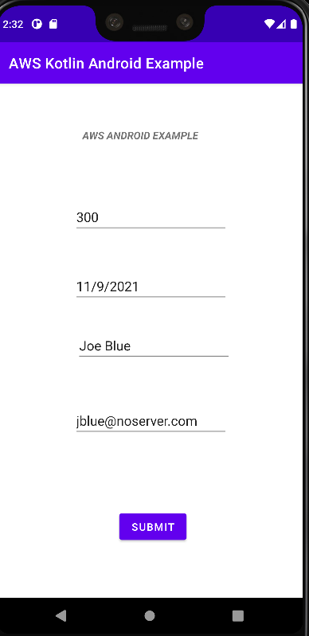
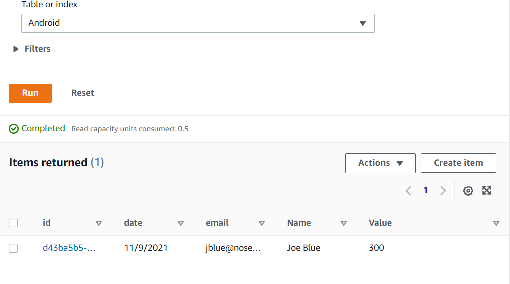
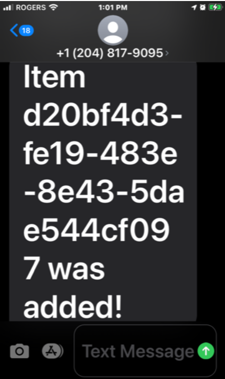
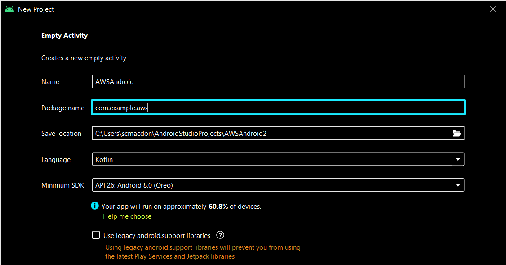
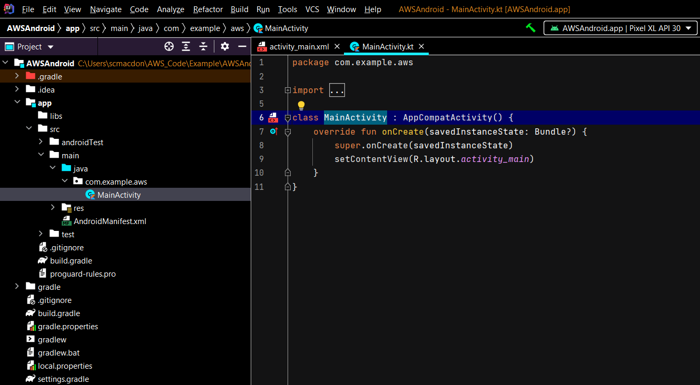
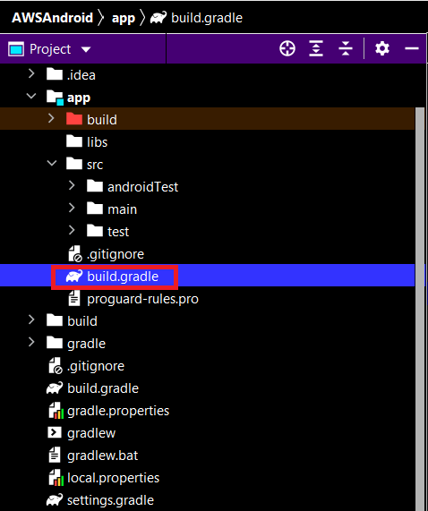
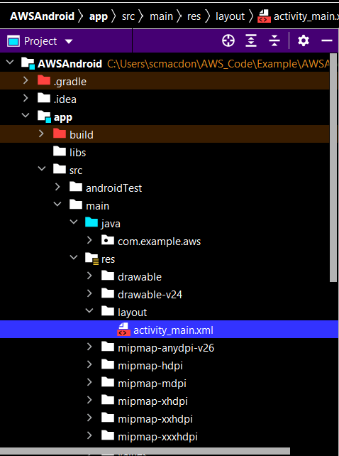
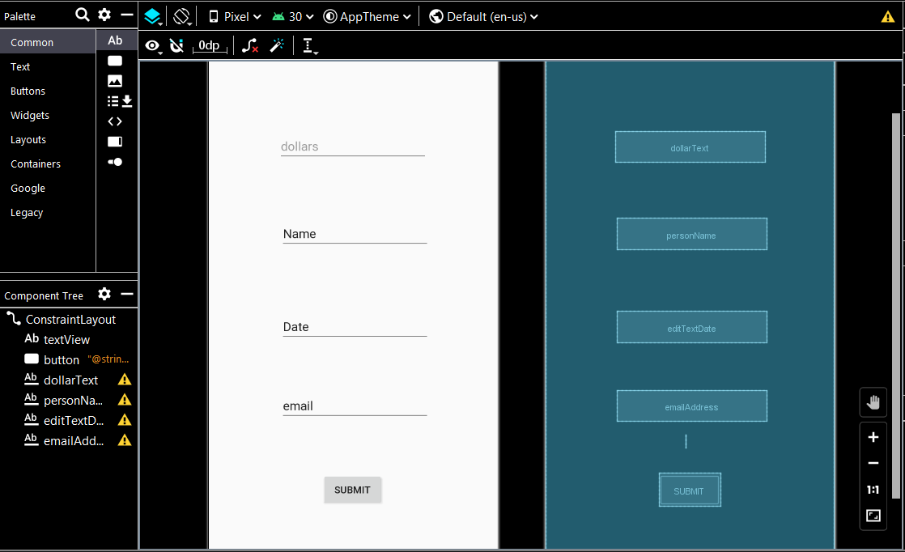
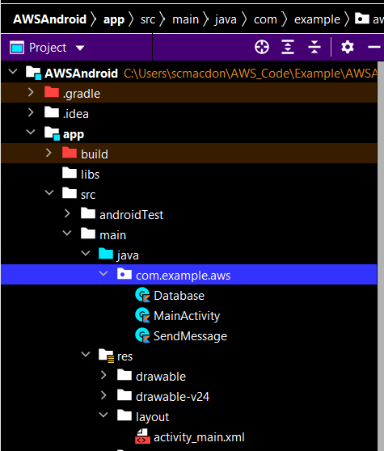
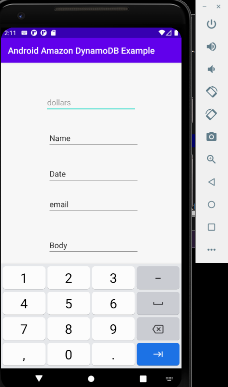

# Creating your first Native Android application using the AWS SDK for Kotlin

## Purpose
You can develop a native Android application that lets application users submit mobile data to an Amazon DynamoDB table by using the AWS SDK for Kotlin. In addition to using Amazon DynamoDB Kotlin API, this Android application also uses the Amazon Simple Notification Service (Amazon SNS) Kotlin API. For example, this Android application uses the **aws.sdk.kotlin.services.dynamodb.DynamoDbClient** to store data within a DynamoDB table. After the DynamoDB table is updated, the application uses the Kotlin Amazon SNS API to send a text message to notify a user. This application also uses the Android API to build the application logic. For more information, see [Android API reference](https://developer.android.com/reference.html).

The Amazon DynamoDB Kotlin API lets you perform the following tasks from within an Android project:

* Access your tables
* Perform various create, read, update, and delete (CRUD) operations
* Execute queries

The following shows the application you'll create.

When you choose **Submit**, the data is persisted into an Amazon DynamoDB table named **Android**, as shown in the following illustration.

After the table is updated with a new item, a text message is sent to notify a mobile user who monitors the submissions.

This tutorial guides you through creating a sample Native Android application that invokes Amazon DynamoDB and Amazon Simple Notification Service (SNS) by using the AWS SDK for Kotlin. 

#### Topics

+ Prerequisites
+ Create an Android project named **AWSAndroid**
+ Add the dependencies to your Andorid project
+ Create the layout XML file for your Android project
+ Create the Kotlin classes for your Android project
+ Run the Android application

## Prerequisites

To complete the tutorial, you need the following:

+ An AWS account
+ An IDE that lets you build Android projects (this example uses Android Studio)
+ Java 1.8 SDK
+ Gradle 6.8 or higher
+ Min API version is 24
+ Requires core library desugaring in the Gradle build file
+ Source/target compat of 1.8

### Important

+ The AWS services included in this document are included in the [AWS Free Tier](https://aws.amazon.com/free/?all-free-tier.sort-by=item.additionalFields.SortRank&all-free-tier.sort-order=asc).
+  This code has not been tested in all AWS Regions. Some AWS services are available only in specific regions. For more information, see [AWS Regional Services](https://aws.amazon.com/about-aws/global-infrastructure/regional-product-services). 
+ Running this code might result in charges to your AWS account. 
+ Be sure to terminate all of the resources you create while going through this tutorial to ensure that you’re not charged.

### Creating the resources

Create an Amazon DynamoDB table named **Android** that contains a partition key named **id**. For information about creating an Amazon DynamoDB table, see [Create a Table](https://docs.aws.amazon.com/amazondynamodb/latest/developerguide/getting-started-step-1.html). 

## Create an Android project named AWSAndroid
The first step is to create an Android project.

1. In Android Studio, choose **File**, **New**, **Project**.
2. In the **New Project** dialog box, choose **Empty Activity**.
3. Choose **Next**.
5. In the **Name** field, enter **AWSAndroid**.
6. In the **Package name** field, enter **com.example.aws**. 
7. From the **Language** field, choose **Kotlin**. 
8. In the **Minimum API** field, specify **API 26 - Android 8**.
9. Choose **Finish**.

## Add the dependencies to your Android project

At this point, you have a new project named **AWSAndroid** with a default Kotlin class named **MainActivity**.

Notice that there is Gradle build file here:

Add the following dependencies to the Gradle build file.

    apply plugin: 'com.android.application'
    apply plugin: 'kotlin-android'
    apply plugin: 'kotlin-android-extensions'

    android {

     compileOptions {
        sourceCompatibility = 1.8
        targetCompatibility = 1.8
        coreLibraryDesugaringEnabled true
    }

    kotlinOptions {
        jvmTarget = "1.8"
    }

    compileSdkVersion 30
    buildToolsVersion "30.0.0"

    packagingOptions {
        exclude 'META-INF/DEPENDENCIES'
        exclude 'META-INF/LICENSE'
        exclude 'META-INF/LICENSE.txt'
        exclude 'META-INF/license.txt'
        exclude 'META-INF/NOTICE'
        exclude 'META-INF/NOTICE.txt'
        exclude 'META-INF/notice.txt'
        exclude 'META-INF/ASL2.0'
        exclude("META-INF/*.kotlin_module")
    }

    defaultConfig {
        applicationId "com.example.aws"
        minSdkVersion 26
        targetSdkVersion 30
        versionCode 1
        versionName "1.0"

        testInstrumentationRunner "androidx.test.runner.AndroidJUnitRunner"
    }

    buildTypes {
        release {
            minifyEnabled false
            proguardFiles getDefaultProguardFile('proguard-android-optimize.txt'), 'proguard-rules.pro'
        }
     } 
    }

    dependencies {
     implementation fileTree(dir: "libs", include: ["*.jar"])
     implementation("aws.sdk.kotlin:dynamodb:0.9.0-alpha")
     implementation("aws.sdk.kotlin:sns:0.9.0-alpha")  {
        exclude group: "xmlpull", module: "xmlpull"
    }
     coreLibraryDesugaring 'com.android.tools:desugar_jdk_libs:1.1.5'
     implementation "org.jetbrains.kotlin:kotlin-stdlib:$kotlin_version"
     implementation 'androidx.core:core-ktx:1.6.0'
     implementation 'androidx.appcompat:appcompat:1.3.1'
     implementation 'androidx.constraintlayout:constraintlayout:2.1.0'
     testImplementation 'junit:junit:4.12'
     androidTestImplementation 'androidx.test.ext:junit:1.1.3'
     androidTestImplementation 'androidx.test.espresso:espresso-core:3.4.0'
    }

    
## Create the layout XML file for your Android project

The user interface for your Android project is defined in an XML file named **activity_main.xml**, as shown in this illustration. 

You can modify this XML file to define the user interface in the Android application.  

Replace the XML code in the  **activity_main.xml** file with the following XML code. 

       <?xml version="1.0" encoding="utf-8"?>
       <androidx.constraintlayout.widget.ConstraintLayout xmlns:android="http://schemas.android.com/apk/res/android"
                                                   xmlns:app="http://schemas.android.com/apk/res-auto"
                                                   xmlns:tools="http://schemas.android.com/tools"
                                                   android:layout_width="match_parent"
                                                   android:layout_height="match_parent"
                                                   tools:context=".MainActivity">

    <TextView
            android:id="@+id/textView"
            android:layout_width="wrap_content"
            android:layout_height="wrap_content"
            android:text=""
            app:layout_constraintBottom_toBottomOf="parent"
            app:layout_constraintLeft_toLeftOf="parent"
            app:layout_constraintRight_toRightOf="parent"
            app:layout_constraintTop_toTopOf="parent" app:layout_constraintHorizontal_bias="0.485"
            app:layout_constraintVertical_bias="0.772"/>

    <Button
            android:id="@+id/button"
            android:layout_width="wrap_content"
            android:layout_height="wrap_content"
            android:layout_marginTop="36dp"
            android:onClick="submitData"
            android:text="@string/convert_string"
            app:layout_constraintEnd_toEndOf="parent"
            app:layout_constraintStart_toStartOf="parent"
            app:layout_constraintTop_toBottomOf="@+id/textView" app:layout_constraintHorizontal_bias="0.498"/>
    <EditText
            android:id="@+id/dollarText"
            android:layout_width="wrap_content"
            android:layout_height="wrap_content"
            android:layout_marginTop="116dp"
            android:ems="10"
            android:hint="@string/dollars_hint"
            android:inputType="numberDecimal"
            app:layout_constraintEnd_toEndOf="parent"
            app:layout_constraintStart_toStartOf="parent"
            app:layout_constraintTop_toTopOf="parent"/>
    <EditText
            android:layout_width="wrap_content"
            android:layout_height="wrap_content"
            android:inputType="textPersonName"
            android:text="Name"
            android:ems="10"
            android:id="@+id/personName"
            app:layout_constraintTop_toBottomOf="@+id/dollarText"
            android:layout_marginTop="80dp" app:layout_constraintEnd_toEndOf="parent" android:layout_marginEnd="96dp"
            android:autofillHints=""/>
    <EditText
            android:layout_width="wrap_content"
            android:layout_height="wrap_content"
            android:inputType="date"
            android:ems="10"
            android:id="@+id/editTextDate"
            android:text="Date" app:layout_constraintTop_toBottomOf="@+id/personName"
            android:layout_marginTop="88dp" app:layout_constraintEnd_toEndOf="parent" android:layout_marginEnd="96dp"/>
    <EditText
            android:layout_width="wrap_content"
            android:layout_height="wrap_content"
            android:inputType="textEmailAddress"
            android:ems="10"
            android:id="@+id/emailAddress"
            app:layout_constraintTop_toBottomOf="@+id/editTextDate"
            android:layout_marginTop="68dp" app:layout_constraintEnd_toEndOf="parent" android:layout_marginEnd="96dp"
            android:text="email"/>

    </androidx.constraintlayout.widget.ConstraintLayout>

### Update the Strings.xml file

In the **strings.xml** file under **res/values**, ensure this file looks like this code. 

     <resources>
      <string name="app_name">Android Amazon DynamoDB Example</string>
      <string name="convert_string">Submit</string>
      <string name="dollars_hint">dollars</string>
      <string name="no_value_string">No Value</string>
     </resources>

## Create the Kotlin classes for your Android project

In the **com.example.aws** package, add additional Kotlin files, as shown in this illustration.

The Kotlin files in this package are the following:

+ **Database** - A Kotlin class that injects data into an Amazon DynamoDB table by using the Amazon DynamoDB Kotlin API.
+ **MainActivity** - A Kotlin class that extends **AppCompatActivity**.
+ **SendMessage** - A Kotlin class that sends a text message using the Amazon SNS Kotlin API.

### Create the Database class

In the **com.example.aws** package, create a Kotlin class named **Database** that injects data into a DynamoDB table. The following code represents this class.

	package com.example.aws

        import aws.sdk.kotlin.services.dynamodb.DynamoDbClient
        import aws.sdk.kotlin.services.dynamodb.model.AttributeValue
        import aws.sdk.kotlin.services.dynamodb.model.PutItemRequest
        import aws.sdk.kotlin.services.dynamodb.model.DynamoDbException
        import kotlin.system.exitProcess

       class Database {

       suspend fun putItemInTable2(
         ddb: DynamoDbClient,
         tableNameVal: String,
         key: String,
         keyVal: String,
         moneyTotal: String,
         moneyTotalValue: String,
         name: String,
         nameValue: String,
         email: String,
         emailVal: String
        ) {
        
	  val itemValues = mutableMapOf<String, AttributeValue>()

          // Add all content to the table.
          itemValues[key] = AttributeValue.S(keyVal)
          itemValues[moneyTotal] =  AttributeValue.S(moneyTotalValue)
          itemValues[name] = AttributeValue.S(nameValue)
          itemValues[email] = AttributeValue.S(emailVal)

          val request = PutItemRequest {
            tableName=tableNameVal
            item = itemValuesz
          }

         try {
            ddb.putItem(request)
            println(" A new item was placed into $tableNameVal.")

         } catch (ex: DynamoDbException) {
            println(ex.message)
            ddb.close()
            exitProcess(0)
          }
        }
     }

### Create the MainActivity class

The following Kotlin code represents the **MainActivity** Kotlin class. To handle the required AWS Credentials, notice the use of a **StaticCredentialsProvider** object. 

     package com.example.aws

    import androidx.appcompat.app.AppCompatActivity
    import android.os.Bundle
    import android.view.View
    import android.widget.EditText
    import android.widget.Toast
    import aws.sdk.kotlin.runtime.auth.credentials.StaticCredentialsProvider
    import aws.sdk.kotlin.services.dynamodb.DynamoDbClient
    import aws.sdk.kotlin.services.sns.SnsClient
    import kotlinx.coroutines.runBlocking
    import java.util.*

    class MainActivity : AppCompatActivity() {
     override fun onCreate(savedInstanceState: Bundle?) {
        super.onCreate(savedInstanceState)
        setContentView(R.layout.activity_main)
        }

     fun submitData(view: View) = runBlocking{

        val dollarField: EditText =  findViewById(R.id.dollarText)
        val nameField: EditText =  findViewById(R.id.personName)
        val emailField: EditText =  findViewById(R.id.emailAddress)

        val data = Database()

        val staticCredentials = StaticCredentialsProvider {
            accessKeyId = "<Enter key>"
            secretAccessKey = "<Enter secret key>"
        }

        val ddb = DynamoDbClient{
            region = "us-east-1"
            credentialsProvider = staticCredentials
        }

        //Set values
        val uuid: UUID = UUID.randomUUID()
        val tableName = "Android"
        val key = "id"
        val keyVal = uuid.toString()
        val moneyTotal = "Value"
        val moneyTotalValue = dollarField.text.toString()
        val name = "Name"
        val NameVal = nameField.text.toString()
        val email = "email"
        val emailVal = emailField.text.toString()

        data.putItemInTable2(ddb, tableName, key, keyVal, moneyTotal, moneyTotalValue, name, NameVal, email, emailVal);
        ddb.close()

        // Notify user
        val snsClient = SnsClient{
            region = "us-east-1"
            credentialsProvider = staticCredentials
        }

        val sendMSG = SendMessage()
        val mobileNum = "<Enter Mobile Number"
        val message = "Item $uuid was added!"
        sendMSG.pubTextSMS( snsClient,message, mobileNum )
        showToast("Item added")
     }

     fun showToast(value:String){
        val toast = Toast.makeText(applicationContext, value, Toast.LENGTH_SHORT)
        toast.setMargin(50f, 50f)
        toast.show()
     }
    }

**Note**: Be sure to specify your key values; otherwise, your Android application does not work. 

### Create the SendMessage class

The following Kotlin code represents the **SendMessage** Kotlin class that sends a text message when a new item is added to the DynamoDB table.

       package com.example.aws
       import aws.sdk.kotlin.services.sns.SnsClient
       import aws.sdk.kotlin.services.sns.model.PublishRequest
       import aws.sdk.kotlin.services.sns.model.SnsException
       import kotlin.system.exitProcess

      class SendMessage {

       suspend fun pubTextSMS(snsClient: SnsClient, messageVal: String?, phoneNumberVal: String?) {
        try {
            val request = PublishRequest {
                message = messageVal
                phoneNumber = phoneNumberVal
            }

            val result = snsClient.publish(request)
            println("${result.messageId} message sent.")

        } catch (e: SnsException) {
            println(e.message)
            snsClient.close()
            exitProcess(0)
        }
      }
     }

## Run the Android application

To run the application from the IDE, you must ensure that have you have installed an Android emulator which simulates an Android application. For more information, see [Run apps on the Android Emulator](https://developer.android.com/studio/run/emulator).  

Once you install the emulator, you can run the application and then the application appears in the emulator. 

### Next steps
Congratulations! You have created your first Native Android application that interacts with AWS services by using the AWS SDK for Kotlin. As stated at the beginning of this tutorial, be sure to terminate all of the resources that you created while going through this tutorial to ensure that you’re no longer charged for them.
