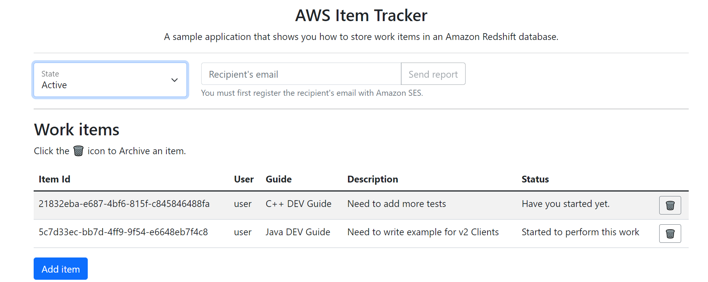
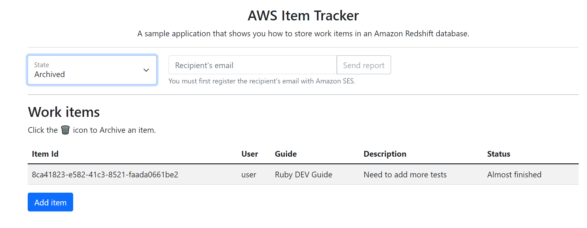
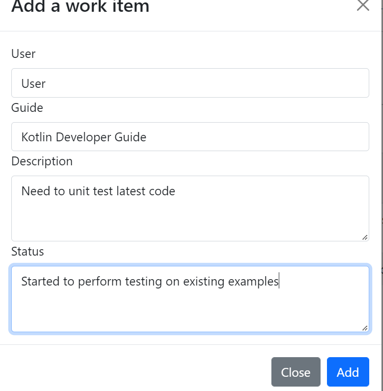
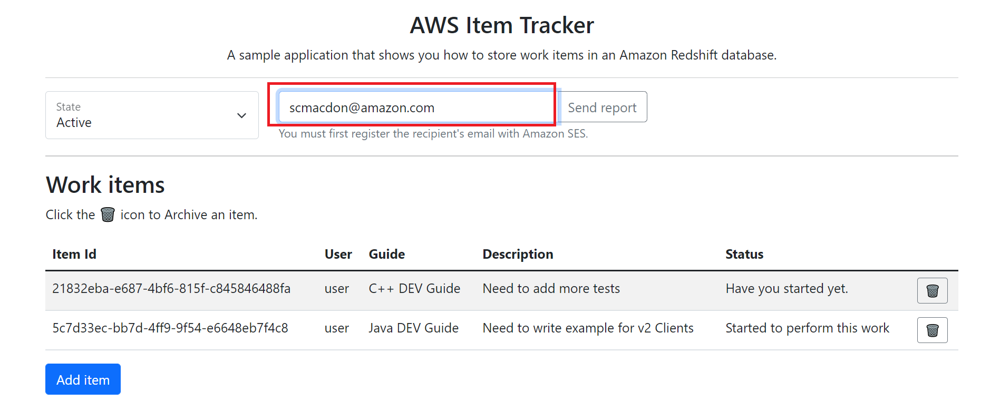
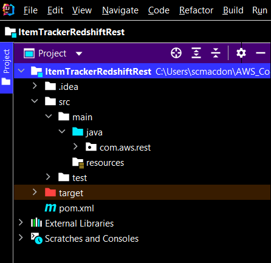
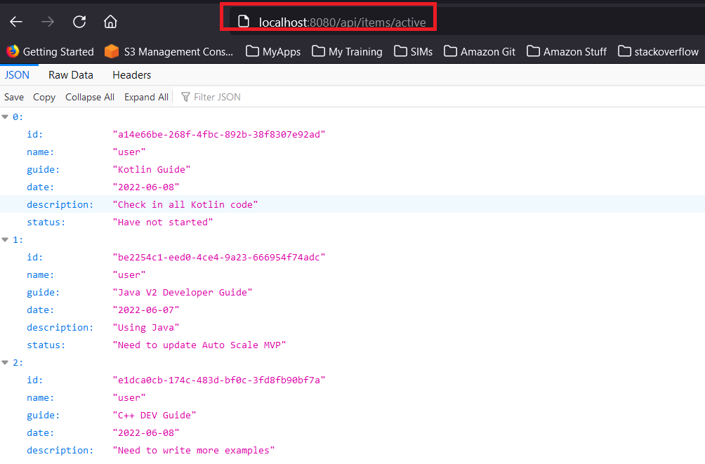

# Building an Amazon Redshift Web Application with Spring Boot

## Overview

| Heading      | Description |
| ----------- | ----------- |
| Description | Discusses how to develop a web application using Spring Boot that queries Amazon Redshift data. This application uses the AWS SDK for Java (v2) to invoke AWS services and is used by a React application that displays the data.   |
| Audience   |  Developer (intermediate)        |
| Updated   | 10/04/2022        |
| Required skills   | Java, Maven, JavaScript  |

## Purpose

You can develop a dynamic web application that tracks and reports on work items by using the following AWS services:

+ Amazon Redshift
+ Amazon Simple Email Service (Amazon SES). (The SDK for Java (v2) is used to access Amazon SES.)

The application you create is a decoupled React application that uses Spring Boot and the Amazon Redshift Java API to return Amazon Redshift data. That is, the React application interacts with a Spring Boot application by making HTTP requests. The Spring Boot application uses a [RedshiftDataClient](https://sdk.amazonaws.com/java/api/latest/software/amazon/awssdk/services/redshiftdata/RedshiftDataClient.html) object to perform CRUD operations on the Amazon Redshift database. Then, the Spring application returns JSON data in an HTTP response, as shown in the following illustration. 


#### Topics

+ Prerequisites
+ Understand the AWS Tracker application
+ Create an IntelliJ project named ItemTrackerRedshiftRest
+ Add the Spring POM dependencies to your project
+ Create the Java classes
+ Create the React front end

## Prerequisites

To complete the tutorial, you need the following:

+ An AWS account.
+ A Java IDE to build the Spring REST API. This tutorial uses the IntelliJ IDE.
+ Java JDK 11. (The code in this example uses APIs that are available in JDK 11).
+ Maven 3.6 or later.
+ Set up your development environment. For more information, 
see [Get started with the SDK for Java](https://docs.aws.amazon.com/sdk-for-java/latest/developer-guide/setup.html). 

### Important

+ The AWS services in this document are included in the [AWS Free Tier](https://aws.amazon.com/free/?all-free-tier.sort-by=item.additionalFields.SortRank&all-free-tier.sort-order=asc).
+  This code has not been tested in all AWS Regions. Some AWS services are available only in specific Regions. For more information, see [AWS Regional Services](https://aws.amazon.com/about-aws/global-infrastructure/regional-product-services). 
+ Running this code might result in charges to your AWS account. 
+ Be sure to delete all of the resources that you create during this tutorial so that you won't be charged.

### Creating the resources

To create the required resources, create an Amazon Redshift cluster and then create a database named **dev**. Next, create a table named **Work** that contains the following fields:

+ **idwork** - A VARCHAR(45) value that represents the PK.
+ **date** - A date value that specifies the date the item was created.
+ **description** - A VARCHAR(400) value that describes the item.
+ **guide** - A VARCHAR(45) value that represents the deliverable being worked on.
+ **status** - A VARCHAR(400) value that describes the status.
+ **username** - A VARCHAR(45) value that represents the user who entered the item.
+ **archive** - A TINYINT(4) value that represents whether this is an active or archive item.

The following image shows the Amazon Redshift **Work** table.


To use the **RedshiftDataClient** object, you must have the following Amazon Redshift values: 

+ The name of the database (for example, dev)
+ The name of the database user that you configured
+ The name of the Amazon Redshift cluster (for example, redshift-cluster-1)

For more information, see [Getting started with Amazon Redshift clusters and data loading](https://docs.aws.amazon.com/redshift/latest/gsg/database-tasks.html).


## Understanding the AWS Tracker React application 

A user can perform the following tasks by using the React application:

+ View all active items.
+ View archived items that are complete.
+ Add a new item. 
+ Convert an active item into an archived item.
+ Send a report to an email recipient.

The React application displays *active* and *archive* items. For example, the following image shows the React application displaying active data.



Likewise, the following image shows the React application displaying archived data.



The React application also lets a user enter a new item. 



The user can enter an email recipient into the text field and choose **Send Report**.



Active items are queried from the database and used to dynamically create an Excel document. Then, the application uses Amazon SES to email the document to the selected email recipient. The following image shows an example of a report.


## Creating an IntelliJ project named ItemTrackerRedshiftRest

1. In the IntelliJ IDE, choose **File**, **New**, **Project**.
2. In the Project SDK, choose 11.
3. In the **New Project** dialog box, choose **Maven**, and then choose **Next**.
4. For **GroupId**, enter **aws-spring**.
5. For **ArtifactId**, enter **ItemTrackerRedshiftRest**.
6. Choose **Next**.
7. Choose **Finish**.

## Adding the POM dependencies to your project

At this point, you have a new project named **ItemTrackerRedshiftRest**.



**Note:** Make sure to use Java 11 (as shown in the following example).

Confirm that the **pom.xml** file looks like the following example.

```xml
<?xml version="1.0" encoding="UTF-8"?>
<project xmlns="http://maven.apache.org/POM/4.0.0"
         xmlns:xsi="http://www.w3.org/2001/XMLSchema-instance"
         xsi:schemaLocation="http://maven.apache.org/POM/4.0.0 http://maven.apache.org/xsd/maven-4.0.0.xsd">
    <modelVersion>4.0.0</modelVersion>
    <groupId>org.example</groupId>
    <artifactId>ItemTrackerRedshiftRest</artifactId>
    <version>1.0-SNAPSHOT</version>
    <parent>
        <groupId>org.springframework.boot</groupId>
        <artifactId>spring-boot-starter-parent</artifactId>
        <version>2.0.4.RELEASE</version>
        <relativePath /> <!-- lookup parent from repository -->
    </parent>
    <properties>
        <project.build.sourceEncoding>UTF-8</project.build.sourceEncoding>
        <java.version>11</java.version>
    </properties>
    <dependencyManagement>
        <dependencies>
            <dependency>
                <groupId>software.amazon.awssdk</groupId>
                <artifactId>bom</artifactId>
                <version>2.17.146</version>
                <type>pom</type>
                <scope>import</scope>
            </dependency>
        </dependencies>
    </dependencyManagement>
    <dependencies>
        <dependency>
            <groupId>org.junit.jupiter</groupId>
            <artifactId>junit-jupiter-api</artifactId>
            <version>5.9.0</version>
            <scope>test</scope>
        </dependency>
        <dependency>
            <groupId>org.junit.jupiter</groupId>
            <artifactId>junit-jupiter-engine</artifactId>
            <version>5.9.0</version>
            <scope>test</scope>
        </dependency>
        <dependency>
            <groupId>org.junit.platform</groupId>
            <artifactId>junit-platform-commons</artifactId>
            <version>1.9.0</version>
        </dependency>
        <dependency>
            <groupId>org.junit.platform</groupId>
            <artifactId>junit-platform-launcher</artifactId>
            <version>1.9.0</version>
            <scope>test</scope>
        </dependency>
        <dependency>
            <groupId>software.amazon.awssdk</groupId>
            <artifactId>ses</artifactId>
        </dependency>
        <dependency>
            <groupId>org.assertj</groupId>
            <artifactId>assertj-core</artifactId>
            <version>3.23.1</version>
            <scope>test</scope>
        </dependency>
        <dependency>
            <groupId>software.amazon.awssdk</groupId>
            <artifactId>redshift</artifactId>
        </dependency>
        <dependency>
            <groupId>software.amazon.awssdk</groupId>
            <artifactId>redshiftdata</artifactId>
        </dependency>
        <dependency>
            <groupId>software.amazon.awssdk</groupId>
            <artifactId>protocol-core</artifactId>
        </dependency>
        <dependency>
            <groupId>jakarta.mail</groupId>
            <artifactId>jakarta.mail-api</artifactId>
            <version>2.1.0</version>
        </dependency>
        <dependency>
            <groupId>com.sun.mail</groupId>
            <artifactId>jakarta.mail</artifactId>
            <version>2.0.1</version>
        </dependency>
        <dependency>
            <groupId>mysql</groupId>
            <artifactId>mysql-connector-java</artifactId>
            <scope>runtime</scope>
        </dependency>
        <dependency>
            <groupId>net.sourceforge.jexcelapi</groupId>
            <artifactId>jxl</artifactId>
            <version>2.6.12</version>
        </dependency>
        <dependency>
            <groupId>commons-io</groupId>
            <artifactId>commons-io</artifactId>
            <version>2.6</version>
        </dependency>
        <dependency>
            <groupId>org.springframework.boot</groupId>
            <artifactId>spring-boot-starter-web</artifactId>
        </dependency>
        <dependency>
            <groupId>org.springframework.boot</groupId>
            <artifactId>spring-boot-starter-test</artifactId>
            <scope>test</scope>
            <exclusions>
                <exclusion>
                    <groupId>org.junit.vintage</groupId>
                    <artifactId>junit-vintage-engine</artifactId>
                </exclusion>
            </exclusions>
        </dependency>
    </dependencies>
    <build>
        <plugins>
            <plugin>
                <groupId>org.springframework.boot</groupId>
                <artifactId>spring-boot-maven-plugin</artifactId>
            </plugin>
        </plugins>
    </build>
</project>
```

## Creating the Java classes

Create a Java package in the **main/java** folder named **com.aws.rest**. The following Java files go into this package:

+ **App** - The entry point into the Spring boot application.  
+ **MainController** - Represents the Spring Controller that handles HTTP requests.
+ **RetrieveItems** - Retrieves a dataset from the **Work** table. 
+ **InjectWorkService** - Injects a new item into the **Work** table. 
+ **SendMessage** - Uses the **software.amazon.awssdk.services.ses.SesClient** object to send email messages.
+ **WorkItem** - Represents the application's data model.
+ **WriteExcel** - Uses the Java Excel API to dynamically create a report. (This does not use AWS SDK for Java API operations).

### App class 

The following Java code represents the **App** class. This is the entry point into a Spring boot application. Notice that you are required to specify three values (database, database user, and clusterId value) to use the **RedshiftDataClient** object (as discussed in the Creating the resources section). Without all of these values, your code won't work. To use the **RedshiftDataClient**, you must create an **ExecuteStatementRequest** object and specify these values.  

```java
package com.aws.rest;

import org.springframework.boot.SpringApplication;
import org.springframework.boot.autoconfigure.SpringBootApplication;
import software.amazon.awssdk.auth.credentials.ProfileCredentialsProvider;
import software.amazon.awssdk.regions.Region;
import software.amazon.awssdk.services.redshiftdata.model.DescribeStatementRequest;
import software.amazon.awssdk.services.redshiftdata.model.DescribeStatementResponse;
import software.amazon.awssdk.services.redshiftdata.model.ExecuteStatementRequest;
import software.amazon.awssdk.services.redshiftdata.model.ExecuteStatementResponse;
import software.amazon.awssdk.services.redshiftdata.model.GetStatementResultRequest;
import software.amazon.awssdk.services.redshiftdata.model.GetStatementResultResponse;
import software.amazon.awssdk.services.redshiftdata.model.RedshiftDataException;
import software.amazon.awssdk.services.redshiftdata.RedshiftDataClient;
import software.amazon.awssdk.services.redshiftdata.model.SqlParameter;
import java.util.List;
import java.util.stream.Collectors;

@SpringBootApplication
public class App {

    // Specify the database name, the database user, and the cluster Id value.
    private static final String database = "dev";
    private static final String dbUser ="awsuser";
    private static final String clusterId = "redshift-cluster-1";

    static RedshiftDataClient getClient() {

        Region region = Region.US_WEST_2;
        return RedshiftDataClient.builder()
            .region(region)
            .credentialsProvider(ProfileCredentialsProvider.create())
            .build();
    }

    static List<WorkItem> getResults(String statementId) {
        try {
            GetStatementResultRequest resultRequest = GetStatementResultRequest.builder()
                .id(statementId)
                .build();

            GetStatementResultResponse response = App.getClient().getStatementResult(resultRequest);
            return response
                .records()
                .stream()
                .map(WorkItem::from)
                .collect(Collectors.toUnmodifiableList());

        } catch (RedshiftDataException e) {
            System.err.println(e.getMessage());
            System.exit(1);
        }
        return null;
    }

    // Update the work table.
    static void flipItemArchive(String sqlStatement,  List<SqlParameter> parameters ) {
        try {
            ExecuteStatementRequest statementRequest = ExecuteStatementRequest.builder()
                .clusterIdentifier(clusterId)
                .database(database)
                .dbUser(dbUser)
                .sql(sqlStatement)
                .parameters(parameters)
                .build();

            App.getClient().executeStatement(statementRequest);

        } catch (RedshiftDataException e) {
            System.err.println(e.getMessage());
            System.exit(1);
        }
    }

    static void checkStatement(String sqlId ) {
        try {
            DescribeStatementRequest statementRequest = DescribeStatementRequest.builder()
                .id(sqlId)
                .build() ;

            // Wait until the sql statement processing is finished.
            String status;
            while (true) {
                DescribeStatementResponse response = App.getClient().describeStatement(statementRequest);
                status = response.statusAsString();
                System.out.println("..."+status);

                if (status.compareTo("FINISHED") == 0) {
                    break;
                }
                Thread.sleep(500);
            }
            System.out.println("The statement is finished!");

        } catch (RedshiftDataException | InterruptedException e) {
            System.err.println(e.getMessage());
            System.exit(1);
        }
    }

    static ExecuteStatementResponse execute(String sqlStatement, List<SqlParameter> parameters) {
        ExecuteStatementRequest sqlRequest = ExecuteStatementRequest.builder()
            .clusterIdentifier(clusterId)
            .database(database)
            .dbUser(dbUser)
            .sql(sqlStatement)
            .parameters(parameters)
            .build();
        return App.getClient().executeStatement(sqlRequest);
    }

   public static void main(String[] args) {
        SpringApplication.run(App.class, args);
    }
}
```    

### MainController class

The following Java code represents the **MainController** class, which handles HTTP requests for the application. Notice the use of the **CrossOrigin** annotation. This annotation lets the controller accept requests from different domains. In addition, notice the use of annotations, such as **@GetMapping**, that maps HTTP requests onto specific handler method.

```java
package com.aws.rest;

import org.springframework.beans.factory.annotation.Autowired;
import org.springframework.web.bind.annotation.GetMapping;
import org.springframework.web.bind.annotation.CrossOrigin;
import org.springframework.web.bind.annotation.PathVariable;
import org.springframework.web.bind.annotation.PutMapping;
import org.springframework.web.bind.annotation.RestController;
import org.springframework.web.bind.annotation.RequestMapping;
import org.springframework.web.bind.annotation.PostMapping;
import org.springframework.web.bind.annotation.RequestBody;
import java.io.IOException;
import java.util.List;
import java.util.Map;

@CrossOrigin(origins = "*")
@RestController
@RequestMapping("api/")
public class MainController {

    @Autowired
    RetrieveItems ri;

    @Autowired
    WriteExcel writeExcel;

    @Autowired
    SendMessage sm;

   @Autowired
   InjectWorkService iw;

    @GetMapping("items/{state}")
    public List< WorkItem > getItems(@PathVariable String state) {
        if (state.compareTo("active") == 0)
            return ri.getData("0") ;
        else
            return ri.getData("1") ;
    }

    // Flip an item from Active to Archive.
    @PutMapping("mod/{id}")
    public String modUser(@PathVariable String id) {
        ri.flipItemArchive(id);
        return id +" was archived";
    }

    // Adds a new item to the database.
    @PostMapping("add")
    String addItems(@RequestBody Map<String, Object> payLoad) {
        String name = "user";
        String guide = (String)payLoad.get("guide");
        String description = (String)payLoad.get("description");
        String status = (String)payLoad.get("status");

        // Create a Work Item object to pass to the injestNewSubmission method.
        WorkItem myWork = new WorkItem();
        myWork.setGuide(guide);
        myWork.setDescription(description);
        myWork.setStatus(status);
        myWork.setName(name);
        iw.injectNewSubmission(myWork);
        return "Item added";
    }

    @PutMapping("report/{email}")
    public String sendReport(@PathVariable String email){
       List<WorkItem> theList = ri.getData("0");
       java.io.InputStream is = writeExcel.exportExcel(theList);
        try {
           sm.sendReport(is, email);
        }catch (IOException e) {
            e.getStackTrace();
        }
        return "Report is created";
    }
}


```

### RetrieveItems class

The following Java code represents the **RetrieveItems** class that retrieves data from the **Work** table. In this example, notice the use of parameters used with the SQL statement. Parameters is a list of [SqlParameter](https://sdk.amazonaws.com/java/api/latest/software/amazon/awssdk/services/redshiftdata/model/SqlParameter.html) objects.

```java
package com.aws.rest;

import java.util.List;
import org.springframework.stereotype.Component;
import software.amazon.awssdk.services.redshiftdata.model.ExecuteStatementResponse;
import software.amazon.awssdk.services.redshiftdata.model.SqlParameter;

@Component
public class RetrieveItems {
   
    static final String username = "user";

    SqlParameter param(String name, String value) {
        return SqlParameter.builder().name(name).value(value).build();
    }

    // Update the work table.
    public void flipItemArchive(String id ) {
        String arc = "1";
        String sqlStatement = "update work set archive = :arc where idwork =:id ";
        List<SqlParameter> parameters = List.of(
                param("arc", arc),
                param("id", id)
        );

        App.flipItemArchive(sqlStatement,parameters);
    }

    // Return items from the work table.
    public List<WorkItem> getData(String arch) {
        String sqlStatement = "SELECT idwork, date, description, guide, status, username "+
            "FROM work WHERE username = :username and archive = :arch ;";

        List<SqlParameter> parameters = List.of(
            param("username", username),
            param("arch", arch)
        );

        ExecuteStatementResponse response = App.execute(sqlStatement,parameters);
        String id = response.id();
        System.out.println("The identifier of the statement is "+id);
        App.checkStatement(id);
        return App.getResults(id);
    }
}

```

### InjectWorkService class

The following Java code represents the **InjectWorkService** class. In this example, notice the use of parameters used with the SQL statement. Parameters is a list of [SqlParameter](https://sdk.amazonaws.com/java/api/latest/software/amazon/awssdk/services/redshiftdata/model/SqlParameter.html) objects.

```java
package com.aws.rest;

import org.springframework.stereotype.Component;
import software.amazon.awssdk.services.redshiftdata.model.ExecuteStatementResponse;
import software.amazon.awssdk.services.redshiftdata.model.RedshiftDataException;
import software.amazon.awssdk.services.redshiftdata.model.SqlParameter;
import java.text.ParseException;
import java.text.SimpleDateFormat;
import java.time.LocalDateTime;
import java.time.format.DateTimeFormatter;
import java.util.Date;
import java.util.List;
import java.util.UUID;

@Component
public class InjectWorkService {


    public String injectNewSubmission(WorkItem item) {
        try {
            String name = item.getName();
            String guide = item.getGuide();
            String description = item.getDescription();
            String status = item.getStatus();
            String archived = "0";

            UUID uuid = UUID.randomUUID();
            String workId = uuid.toString();

            DateTimeFormatter dtf = DateTimeFormatter.ofPattern("yyyy/MM/dd HH:mm:ss");
            LocalDateTime now = LocalDateTime.now();
            String sDate1 = dtf.format(now);
            Date date1 = new SimpleDateFormat("yyyy/MM/dd").parse(sDate1);
            java.sql.Date sqlDate = new java.sql.Date(date1.getTime());

            String sql = "INSERT INTO work (idwork, username, date, description, guide, status, archive) VALUES" +
                "(:idwork, :username, :date, :description, :guide, :status, :archive);";
            List<SqlParameter> paremeters = List.of(
                param("idwork", workId),
                param("username", name),
                param("date", sqlDate.toString()),
                param("description", description),
                param("guide", guide),
                param("status", status),
                param("archive", archived)
            );

            ExecuteStatementResponse result = App.execute(sql, paremeters);
            System.out.println(result.toString());
            return workId;
        } catch (ParseException e) {
            e.printStackTrace();
        }
        return "";
    }

    SqlParameter param(String name, String value) {
        return SqlParameter.builder().name(name).value(value).build();
    }
}

```

### SendMessage class
The **SendMessage** class uses the AWS SDK for Java (v2) SES API to send an email message with an attachment (the Excel document) to an email recipient. Before you can send the email message, the email address that you're sending it to must be verified. For more information, see [Verifying an email address](https://docs.aws.amazon.com/ses/latest/DeveloperGuide//verify-email-addresses-procedure.html).

The following Java code represents the **SendMessage** class. Notice that an **EnvironmentVariableCredentialsProvider** is used. 

```java
package com.aws.rest;

import org.apache.commons.io.IOUtils;
import software.amazon.awssdk.regions.Region;
import software.amazon.awssdk.services.ses.SesClient;
import javax.activation.DataHandler;
import javax.activation.DataSource;
import javax.mail.Message;
import javax.mail.MessagingException;
import javax.mail.Session;
import javax.mail.internet.InternetAddress;
import javax.mail.internet.MimeMessage;
import javax.mail.internet.MimeMultipart;
import javax.mail.internet.MimeBodyPart;
import javax.mail.util.ByteArrayDataSource;
import java.io.ByteArrayOutputStream;
import java.io.IOException;
import java.io.InputStream;
import java.nio.ByteBuffer;
import java.util.Properties;
import software.amazon.awssdk.core.SdkBytes;
import software.amazon.awssdk.services.ses.model.SendRawEmailRequest;
import software.amazon.awssdk.services.ses.model.RawMessage;
import software.amazon.awssdk.services.ses.model.SesException;
import org.springframework.stereotype.Component;

@Component
public class SendMessage {

    private String sender = "scmacdon@amazon.com";

    // The subject line for the email.
    private String subject = "Weekly AWS Status Report";

    // The email body for recipients with non-HTML email clients.
    private String bodyText = "Hello,\r\n" + "Please see the attached file for a weekly update.";

    // The HTML body of the email.
    private String bodyHTML = "<html>" + "<head></head>" + "<body>" + "<h1>Hello!</h1>"
                + "<p>Please see the attached file for a weekly update.</p>" + "</body>" + "</html>";

    public void sendReport(InputStream is, String emailAddress ) throws IOException {

        // Convert the InputStream to a byte[].
        byte[] fileContent = IOUtils.toByteArray(is);

        try {
            send(fileContent,emailAddress);

        } catch (MessagingException e) {
            e.getStackTrace();
        }
    }

    public void send(byte[] attachment, String emailAddress) throws MessagingException, IOException {

        MimeMessage message = null;
        Session session = Session.getDefaultInstance(new Properties());

        // Create a new MimeMessage object.
        message = new MimeMessage(session);

        // Add subject and from and to lines.
        message.setSubject(subject, "UTF-8");
        message.setFrom(new InternetAddress(sender));
        message.setRecipients(Message.RecipientType.TO, InternetAddress.parse(emailAddress));

        // Create a multipart/alternative child container.
        MimeMultipart msgBody = new MimeMultipart("alternative");

        // Create a wrapper for the HTML and text parts.
        MimeBodyPart wrap = new MimeBodyPart();

        // Define the text part.
        MimeBodyPart textPart = new MimeBodyPart();
        textPart.setContent(bodyText, "text/plain; charset=UTF-8");

        // Define the HTML part.
        MimeBodyPart htmlPart = new MimeBodyPart();
        htmlPart.setContent(bodyHTML, "text/html; charset=UTF-8");

        // Add the text and HTML parts to the child container.
        msgBody.addBodyPart(textPart);
        msgBody.addBodyPart(htmlPart);

        // Add the child container to the wrapper object.
        wrap.setContent(msgBody);

        // Create a multipart/mixed parent container.
        MimeMultipart msg = new MimeMultipart("mixed");

        // Add the parent container to the message.
        message.setContent(msg);

        // Add the multipart/alternative part to the message.
        msg.addBodyPart(wrap);

        // Define the attachment.
        MimeBodyPart att = new MimeBodyPart();
        DataSource fds = new ByteArrayDataSource(attachment, "application/vnd.openxmlformats-officedocument.spreadsheetml.sheet");
        att.setDataHandler(new DataHandler(fds));

        String reportName = "WorkReport.xls";
        att.setFileName(reportName);

        // Add the attachment to the message.
        msg.addBodyPart(att);

        // Send the email.
        try {

            System.out.println("Attempting to send an email through Amazon SES " + "using the AWS SDK for Java...");
            Region region = Region.US_WEST_2;
            SesClient client = SesClient.builder()
                     .region(region)
                     .build();

            ByteArrayOutputStream outputStream = new ByteArrayOutputStream();
            message.writeTo(outputStream);
            ByteBuffer buf = ByteBuffer.wrap(outputStream.toByteArray());

            byte[] arr = new byte[buf.remaining()];
            buf.get(arr);

            SdkBytes data = SdkBytes.fromByteArray(arr);
            RawMessage rawMessage = RawMessage.builder()
                     .data(data)
                     .build();

            SendRawEmailRequest rawEmailRequest = SendRawEmailRequest.builder()
                     .rawMessage(rawMessage)
                     .build();

            client.sendRawEmail(rawEmailRequest);

        } catch (SesException e) {
            System.err.println(e.awsErrorDetails().errorMessage());
            System.exit(1);
        }
        System.out.println("Email sent with attachment");
    }
}
```

**Note:** You must update the email **sender** address with a verified email address. Otherwise, the email is not sent. For more information, see [Verifying email addresses in Amazon SES](https://docs.aws.amazon.com/ses/latest/DeveloperGuide/verify-email-addresses.html).       


### WorkItem class

The following Java code represents the **WorkItem** class.   

```java
package com.aws.rest;

import software.amazon.awssdk.services.redshiftdata.model.Field;
import java.util.List;

public class WorkItem {
    private String id;
    private String name;
    private String guide;
    private String date;
    private String description;
    private String status;

    public static WorkItem from(List<Field> fields) {
        WorkItem item = new WorkItem();
        for (int i = 0; i <= 5; i++) {
            String value = fields.get(i).stringValue();
            switch (i) {
                case 0:
                    item.setId(value);
                    break;
                case 1:
                    item.setDate(value);
                    break;
                case 2:
                    item.setDescription(value);
                    break;
                case 3:
                    item.setGuide(value);
                    break;
                case 4:
                    item.setStatus(value);
                    break;
                case 5:
                    item.setName(value);
                    break;
            }
        }
        return item;
    }

    public void setId(String id) {
        this.id = id;
    }

    public String getId() {
        return this.id;
    }

    public void setStatus(String status) {
        this.status = status;
    }

    public String getStatus() {
        return this.status;
    }

    public void setDescription(String description) {
        this.description = description;
    }

    public String getDescription() {
        return this.description;
    }

    public void setDate(String date) {
        this.date = date;
    }

    public String getDate() {
        return this.date;
    }

    public void setName(String name) {
        this.name = name;
    }

    public String getName() {
        return this.name;
    }

    public void setGuide(String guide) {
        this.guide = guide;
    }

    public String getGuide() {
        return this.guide;
    }
}
```
### WriteExcel class

The **WriteExcel** class dynamically creates an Excel report with the data marked as active. The following code represents this class.

```java
 package com.aws.rest;

import jxl.CellView;
import jxl.Workbook;
import jxl.WorkbookSettings;
import jxl.format.UnderlineStyle;
import jxl.write.Label;
import jxl.write.WritableCellFormat;
import jxl.write.WritableFont;
import jxl.write.WritableSheet;
import jxl.write.WritableWorkbook;
import jxl.write.WriteException;
import org.springframework.stereotype.Component;
import java.io.ByteArrayOutputStream;
import java.io.IOException;
import java.util.List;
import java.util.Locale;

@Component
public class WriteExcel {

    private WritableCellFormat timesBoldUnderline;
    private WritableCellFormat times;

    // Returns an InputStream that represents the Excel report.
    public java.io.InputStream exportExcel( List<WorkItem> list) {

        try {
            return write(list);

        } catch(WriteException | IOException e) {
            e.printStackTrace();
        }
        return null;
    }

    // Generates the report and returns an InputStream.
    public java.io.InputStream write( List<WorkItem> list) throws IOException, WriteException {

        ByteArrayOutputStream os = new java.io.ByteArrayOutputStream() ;
        WorkbookSettings wbSettings = new WorkbookSettings();
        wbSettings.setLocale(new Locale("en", "EN"));

        // Create a Workbook - pass the OutputStream.
        WritableWorkbook workbook = Workbook.createWorkbook(os, wbSettings);
        workbook.createSheet("Work Item Report", 0);
        WritableSheet excelSheet = workbook.getSheet(0);
        createLabel(excelSheet) ;
        createContent(excelSheet, list);

        // Close the workbook.
        workbook.write();
        workbook.close();

        // Get an inputStream that represents the report.
        new ByteArrayOutputStream();
        java.io.ByteArrayOutputStream stream;
        stream = os;
        byte[] myBytes = stream.toByteArray();
        return new java.io.ByteArrayInputStream(myBytes);
    }

    // Create headings in the Excel spreadsheet.
    private void createLabel(WritableSheet sheet) throws WriteException {

        // Create a times font.
        WritableFont times10pt = new WritableFont(WritableFont.TIMES, 10);

        // Define the cell format.
        times = new WritableCellFormat(times10pt);

        // Lets automatically wrap the cells.
        times.setWrap(true);

        // Create a bold font with underlining.
        WritableFont times10ptBoldUnderline = new WritableFont(WritableFont.TIMES, 10, WritableFont.BOLD, false, UnderlineStyle.SINGLE);
        timesBoldUnderline = new WritableCellFormat(times10ptBoldUnderline);

        // Automatically wrap the cells.
        timesBoldUnderline.setWrap(true);
        CellView cv = new CellView();
        cv.setFormat(times);
        cv.setFormat(timesBoldUnderline);
        cv.setAutosize(true);

        // Write a few headers.
        addCaption(sheet, 0, 0, "Writer");
        addCaption(sheet, 1, 0, "Date");
        addCaption(sheet, 2, 0, "Guide");
        addCaption(sheet, 3, 0, "Description");
        addCaption(sheet, 4, 0, "Status");
    }

    // Write the Work Item Data to the Excel report.
    private int createContent(WritableSheet sheet, List<WorkItem> list) throws WriteException {

        int size = list.size() ;

        // Add customer data to the Excel report.
        for (int i = 0; i < size; i++) {

            WorkItem wi = list.get(i);

            // Get tne work item values.
            String name = wi.getName();
            String guide = wi.getGuide();
            String date = wi.getDate();
            String des = wi.getDescription();
            String status = wi.getStatus();

            // First column.
            addLabel(sheet, 0, i+2, name);

            // Second column.
            addLabel(sheet, 1, i+2, date);

            // Third column.
            addLabel(sheet, 2, i+2,guide);

            // Forth column.
            addLabel(sheet, 3, i+2, des);

            // Fifth column.
            addLabel(sheet, 4, i+2, status);
        }

        return size;
    }

    private void addCaption(WritableSheet sheet, int column, int row, String s) throws WriteException {
        Label label;
        label = new Label(column, row, s, timesBoldUnderline);

        int cc = countString(s);
        sheet.setColumnView(column, cc);
        sheet.addCell(label);
    }

    private void addLabel(WritableSheet sheet, int column, int row, String s) throws WriteException {
        Label label;
        label = new Label(column, row, s, times);
        int cc = countString(s);
        if (cc > 200)
            sheet.setColumnView(column, 150);
        else
            sheet.setColumnView(column, cc+6);

        sheet.addCell(label);
    }

    private int countString (String ss) {
        int count = 0;
        for(int i = 0; i < ss.length(); i++) {
            if(ss.charAt(i) != ' ')
                count++;
        }
        return count;
    }
}


```


## Running the application 

Using the IntelliJ IDE, you can run your Spring REST API. The first time you run it, choose the run icon in the main class. The Spring API supports the following URLs: 

- /api/items/{state} - A GET request that returns all active or archived data items from the **Work** table. 
- /api/mod/{id} - A PUT request that converts the specified data item to an archived item. 
- /api/add - A POST request that adds a new item to the database. 
- /api/report/{email} - A PUT request that creates a report of active items and emails the report. 

**Note**: The React SPA created in the next section consumes all of these URLs. 

Confirm that the Spring REST API works by viewing the Active items. Enter the following URL into a browser. 

http://localhost:8080/api/items/active

The following image shows the JSON data returned from the Spring REST API. 



## Create the React front end

You can create the React SPA that consumes the JSON data returned from the Spring REST API. To create the React SPA, you can download files from the following GitHub repository. Included in this repository are instructions on how to set up the project. Click the following link to access the GitHub location [Work item tracker web client](https://github.com/awsdocs/aws-doc-sdk-examples/tree/main/resources/clients/react/item-tracker/README.md).  

### Update WorkItem.js

You must modify the **WorkItem.js** file so that your React requests work with your Java backend. Update this file to include this code.

```javascript
import React, {useEffect, useState} from "react";
import Button from "react-bootstrap/Button";
import Form from 'react-bootstrap/Form';
import Modal from "react-bootstrap/Modal";

import * as service from './RestService';

/**
 * An element that displays an 'Add item' button that lets you add an item to the work
 * item list. When you click the 'Add item' button, a modal form is displayed that
 * includes form fields that you can use to define the work item. When you click the
 * 'Add' button on the form, your new work item is sent to the server so it can be
 * added to the database.
 *
 * @returns {JSX.Element}
 */
export const WorkItem = () => {
  const [user, setUser] = useState('');
  const [guide, setGuide] = useState('');
  const [description, setDescription] = useState('');
  const [status, setStatus] = useState('');
  const [show, setShow] = useState(false);
  const [canAdd, setCanAdd] = useState(false);

  useEffect(() => {
    let can = user.length > 0 && guide.length > 0 && description.length > 0 && status.length > 0;
    setCanAdd(can);
  }, [user, guide, description, status]);

  const handleAdd = () => {
    service.addWorkItem({name: user, guide: guide, description: description, status: status})
      .catch(console.error);
    setShow(false);
  };

  const handleClose = () => {
    setShow(false);
  };

  return (
    <>
      <Button onClick={() => setShow(true)} variant="primary">Add item</Button>

      <Modal show={show} onHide={handleClose} dialogClassName="modal-90w">
        <Modal.Header closeButton>
          <Modal.Title>Add a new work item</Modal.Title>
        </Modal.Header>
        <Modal.Body>
          <Form>
            <Form.Group>
              <Form.Label htmlFor='userField'>User</Form.Label>
              <Form.Control id='userField' type="text" placeholder="User name"
                            onChange={(event) => setUser(event.target.value)}/>
            </Form.Group>
            <Form.Group>
              <Form.Label htmlFor='guideField'>Guide</Form.Label>
              <Form.Control id='guideField' type="text" placeholder="Developer guide"
                            onChange={(event) => setGuide(event.target.value)}/>
            </Form.Group>
            <Form.Group>
              <Form.Label htmlFor='descriptionField'>Description</Form.Label>
              <Form.Control as="textarea" rows={3} id='descriptionField'
                            onChange={(event) => setDescription(event.target.value)}/>
            </Form.Group>
            <Form.Group>
              <Form.Label htmlFor='statusField'>Status</Form.Label>
              <Form.Control as="textarea" rows={3} id='statusField'
                            onChange={(event) => setStatus(event.target.value)}/>
            </Form.Group>
          </Form>
        </Modal.Body>
        <Modal.Footer>
          <Button variant="secondary" onClick={handleClose}>Close</Button>
          <Button variant="primary" disabled={!canAdd} onClick={handleAdd}>Add</Button>
        </Modal.Footer>
      </Modal>
    </>
  );
};

```
### Update WorkItems.js

You must modify the **WorkItems.js** file so that your React requests work with your Java backend. Update this file to include this code.

```javascript
import React, {useEffect, useState} from 'react';
import * as service from './RestService';
import Alert from "react-bootstrap/Alert";
import Button from "react-bootstrap/Button";
import Col from "react-bootstrap/Col";
import FloatingLabel from "react-bootstrap/FloatingLabel";
import FormControl from "react-bootstrap/FormControl";
import Form from "react-bootstrap/Form";
import InputGroup from "react-bootstrap/InputGroup";
import Placeholder from "react-bootstrap/Placeholder";
import Row from "react-bootstrap/Row";
import Table from "react-bootstrap/Table";
import {WorkItem} from "./WorkItem";

/**
 * An element that displays a list of work items that are retrieved from a REST service.
 *
 * * Select Active or Archived to display work items with the specified state.
 * * Select the wastebasket icon to archive and active item.
 * * Select 'Add item' to add a new item.
 * * Enter a recipient email and select 'Send report' to send a report of work items.
 *
 * @returns {JSX.Element}
 */

export const WorkItems = () => {
  const [email, setEmail] = useState('');
  const [items, setItems] = useState([]);
  const [loading, setLoading] = useState(false);
  const [status, setStatus] = useState('active');
  const [error, setError] = useState('');

  const getItems = async () => {
    setError('');
    setLoading(true);
    const response = await service.getWorkItems(status).catch((e) => {setError(e.message)});
    setItems(response ? await response.data : []);
    setLoading(false);
  };

  useEffect(() => {
    getItems().catch((e) => {setError(e.message)});
  }, [status]);

  const archiveItem = async (itemId) => {
    service.archiveItem(itemId).catch((e) => {setError(e.message)});
    getItems().catch((e) => {setError(e.message)});
  }

  const sendReport = async () => {
    service.mailItem(email).catch((e) => {setError(e.message)});
  }

  const handleStatusChange = (newStatus) => {
    setStatus(newStatus);
  }

  return (
    <>
      {error !== ''
        ?
        <Row>
          <Col>
            <Alert variant="danger">{error}</Alert>
          </Col>
        </Row>
        : null
      }
      <Row>
        <Col className="col-3">
          <FloatingLabel controlId="floatingSelect" label="State">
            <Form.Select aria-label="Status" onChange={(event) => handleStatusChange(event.target.value)}>
              <option value="active">Active</option>
              <option value="archive">Archived</option>
            </Form.Select>
          </FloatingLabel>
        </Col>
        <Col className="col-5">
          <InputGroup>
            <FormControl onChange={(event) => setEmail(event.target.value)}
              placeholder="Recipient's email"
              aria-label="Recipient's email"
              aria-describedby="basic-addon2"
            />
            <Button
              variant="outline-secondary"
              id="button-addon2"
              disabled={email === ''}
              onClick={() => sendReport()}>
                Send report
            </Button>
          </InputGroup>
          <Form.Text className="text-muted">
            You must first register the recipient's email with Amazon SES.
          </Form.Text>
        </Col>
      </Row>
      <hr/>
      <Row>
        <h3>Work items</h3>
        <p>Click the 🗑 icon to Archive an item.</p>
      </Row>
      <Row style={{maxHeight: `calc(100vh - 400px)`, overflowY: "auto"}}>
        <Col>
          {!loading && items.length === 0
            ? <Alert variant="info">No work items found.</Alert>
            : <Table striped>
              <thead>
              <tr>
                <th>Item Id</th>
                <th>User</th>
                <th>Guide</th>
                <th>Description</th>
                <th>Status</th>
                <th/>
              </tr>
              </thead>
              {loading
                ? <tbody>{
                  [1, 2, 3].map(item =>
                    <tr key={item}>
                      <td><Placeholder animation="glow"><Placeholder xs={3}/></Placeholder></td>
                      <td><Placeholder animation="glow"><Placeholder xs={3}/></Placeholder></td>
                      <td><Placeholder animation="glow"><Placeholder xs={3}/></Placeholder></td>
                      <td><Placeholder animation="glow"><Placeholder xs={3}/></Placeholder></td>
                      <td><Placeholder animation="glow"><Placeholder xs={3}/></Placeholder></td>
                    </tr>
                  )
                }
                </tbody>
                : <tbody>{
                  items.map(item =>
                    <tr key={item.id}>
                      <td>{item.id}</td>
                      <td>{item.name}</td>
                      <td>{item.guide}</td>
                      <td>{item.description}</td>
                      <td>{item.status}</td>
                      <td>{
                        status === 'active' ?
                          <Button variant="outline-secondary" size="sm" onClick={() => archiveItem(item.id)}>🗑</Button>
                          : null
                      }
                      </td>
                    </tr>
                  )
                }
                </tbody>
              }
            </Table>
          }
        </Col>
      </Row>
      <Row>
        <Col>
          <WorkItem />
        </Col>
      </Row>
    </>
  )
};
```


### Update RestService.js

You must modify the **RestService.js** file so that your React requests work with your Java backend. Update this file to include this code.

```javascript

/**
 * Sends REST requests to get work items, add new work items, modify work items,
 * and send an email report.
 *
 * The base URL of the REST service is stored in config.json. If necessary, update this
 * value to your endpoint.
 */

 import axios from 'axios'
 import configData from './config.json'
 
 /**
  * Sends a POST request to add a new work item.
  *
  * @param item: The work item to add.
  * @returns {Promise<void>}
  */
 export const addWorkItem = async (item) => {
        let status = item.status;
        let description = item.description;
        let guide = item.guide;
        let payload = { status: item.status, description: item.description , guide: item.guide};
        await axios.post(`${configData.BASE_URL}/api/add`, payload);
 };
 
 /**
  * Sends a GET request to retrieve work items that are in the specified state.
  *
  * @param state: The state of work items to retrieve. Can be either 'active' or 'archive'.
  * @returns {Promise<AxiosResponse<any>>}: The list of work items that have the
  *                                         specified state.
  */
 export const getWorkItems = async (state) => {
   return await axios.get(`${configData.BASE_URL}/api/items/${state}`);
 };
 
 /**
  * Sends a PUT request to archive an active item.
  *
  * @param itemId: The ID of the item to archive.
  * @returns {Promise<void>}
  */
 export const archiveItem = async (itemId) => {
   await axios.put(`${configData.BASE_URL}/api/mod/${itemId}`);
 }
 
 /**
  * Sends a POST request to email a report of work items.
  *
  * @param email: The report recipient's email address.
  * @returns {Promise<void>}
  */
 export const mailItem = async (email) => {
   await axios.put(`${configData.BASE_URL}/api/report/${email}`);
 }

```
  
### Next steps
Congratulations, you have created a decoupled React application that consumes data from a Spring REST API. The Spring REST API uses the AWS SDK for Java (v2) to invoke AWS services. As stated at the beginning of this tutorial, be sure to delete all of the resources that you create during this tutorial so that you won't continue to be charged.

For more AWS multiservice examples, see
[usecases](https://github.com/awsdocs/aws-doc-sdk-examples/tree/master/javav2/usecases).

