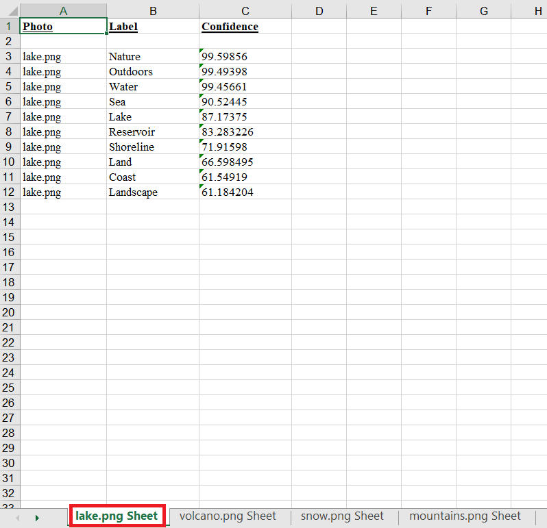
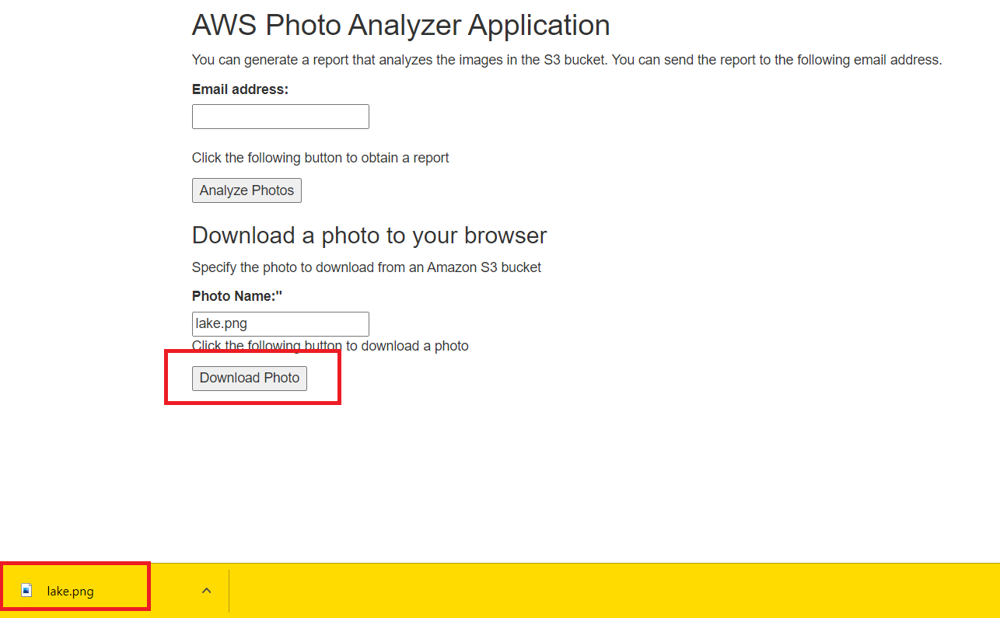
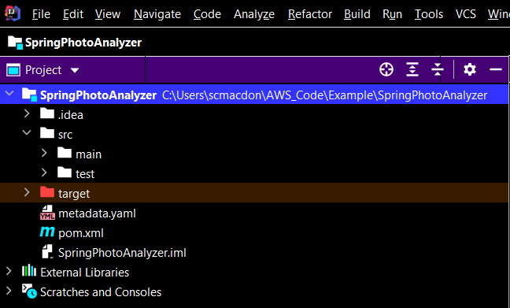
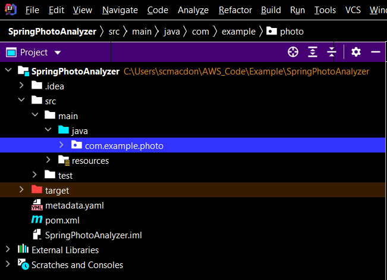
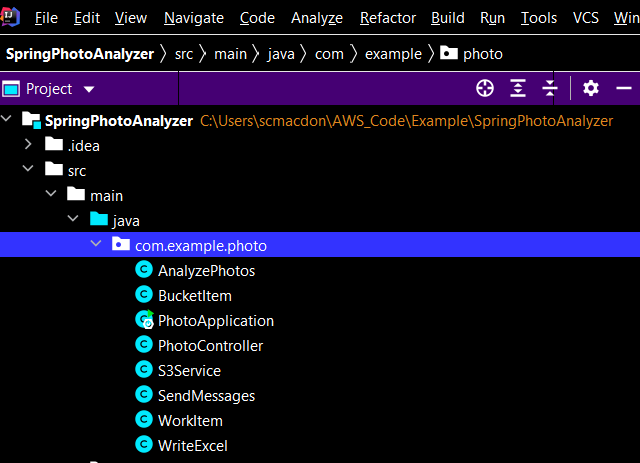

#  Creating a dynamic web application that analyzes photos using the AWS SDK for Java

## Overview

| Heading      | Description |
| ----------- | ----------- |
| Description | Dicusses how to develop a dynamic web application that analyzes nature images located in an Amazon Simple Storage Service (Amazon S3) bucket by using the AWS SDK for Java V2.     |
| Audience   |  Developer (beginner / intermediate)        |
| Updated   | 1/17/2022        |
| Required Skills   | Java, Maven  |

## Purpose
You can create a dynamic web application that analyzes nature images located in an Amazon S3 bucket by using the Amazon Rekognition service. The application analyzes many images and generates a report that breaks down each image into a series of labels. For example, the following image shows a lake.


After the application analyzes all images in the Amazon S3 bucket, it uses the Amazon Simple Email Service (Amazon SES) to send a dynamically created report to a given email recipient. The report is a Microsoft Excel document that contains label data for each image. 



In this tutorial, you create a Spring Boot application named **AWS Photo Analyzer**. The Spring Boot APIs are used to build a model, different views, and a controller. For more information, see [Spring Boot - Securing Web Applications](https://www.tutorialspoint.com/spring_boot/spring_boot_securing_web_applications.htm).

This application uses the following AWS services:
*	Amazon Rekognition
*	Amazon S3
*	Amazon SES
*	AWS Elastic Beanstalk

#### Topics

+ Prerequisites
+ Understand the AWS Photo Analyzer application
+ Create an IntelliJ project named SpringPhotoAnalyzer
+ Add the POM dependencies to your project
+ Create the Java classes
+ Create the HTML files
+ Create the script files
+ Package the project into a JAR file
+ Deploy the application to AWS Elastic Beanstalk

## Prerequisites

To complete the tutorial, you need the following:

+ An AWS account
+ A Java IDE (this tutorial uses the IntelliJ IDE)
+ Java JDK 1.8
+ Maven 3.6 or later

### Important

+ The AWS services included in this document are included in the [AWS Free Tier](https://aws.amazon.com/free/?all-free-tier.sort-by=item.additionalFields.SortRank&all-free-tier.sort-order=asc).
+  This code has not been tested in all AWS Regions. Some AWS services are available only in specific regions. For more information, see [AWS Regional Services](https://aws.amazon.com/about-aws/global-infrastructure/regional-product-services). 
+ Running this code might result in charges to your AWS account. 
+ Be sure to terminate all of the resources you create while going through this tutorial to ensure that you’re not charged.

### Creating the resources

Create an Amazon S3 bucket named **photos[somevalue]**. Be sure to use this bucket name in your Amazon S3 Java code. For information, see [Creating a bucket](https://docs.aws.amazon.com/AmazonS3/latest/gsg/CreatingABucket.html).

## Understand the AWS Photo Analyzer application

The AWS Photo Analyzer application supports uploading images to an Amazon S3 bucket. After the images are uploaded, you can view the images that are analyzed.


To generate a report, enter an email address and choose **Analyze Photos**.


You can also download a given image from the Amazon S3 bucket by using this application. Simply specify the image name and choose the **Download Photo** button. The image is downloaded to your browser, as shown in this illustration. 



## Create an IntelliJ project named SpringPhotoAnalyzer

1. In the IntelliJ IDE, choose **File**, **New**, **Project**.
2. In the **New Project** dialog box, choose **Maven**, and then choose **Next**.
3. For **GroupId**, enter **aws-spring**.
4. For **ArtifactId**, enter **SpringPhotoAnalyzer**.
6. Choose **Next**.
7. Choose **Finish**.

## Add the POM dependencies to your project

At this point, you have a new project named **SpringPhotoAnalyzer**.



**Note:** Ensure that you are using Java 1.8 (as shown in the following **pom.xml** file).

Ensure that the **pom.xml** file looks like the following.

```xml
     <?xml version="1.0" encoding="UTF-8"?>
     <project xmlns="http://maven.apache.org/POM/4.0.0" xmlns:xsi="http://www.w3.org/2001/XMLSchema-instance"
         xsi:schemaLocation="http://maven.apache.org/POM/4.0.0 https://maven.apache.org/xsd/maven-4.0.0.xsd">
     <modelVersion>4.0.0</modelVersion>
     <groupId>com.example.photo</groupId>
     <artifactId>photo</artifactId>
     <version>0.0.1-SNAPSHOT</version>
     <name>photo</name>
     <description>Demo project for Spring Boot</description>
     <parent>
        <groupId>org.springframework.boot</groupId>
        <artifactId>spring-boot-starter-parent</artifactId>
        <version>2.0.4.RELEASE</version>
        <relativePath/> <!-- lookup parent from repository -->
     </parent>
     <properties>
        <java.version>1.8</java.version>
     </properties>
     <dependencyManagement>
        <dependencies>
            <dependency>
                <groupId>software.amazon.awssdk</groupId>
                <artifactId>bom</artifactId>
                <version>2.10.54</version>
                <type>pom</type>
                <scope>import</scope>
            </dependency>
        </dependencies>
     </dependencyManagement>
     <dependencies>
        <dependency>
            <groupId>org.springframework.boot</groupId>
            <artifactId>spring-boot-starter-thymeleaf</artifactId>
        </dependency>
        <dependency>
            <groupId>org.springframework.boot</groupId>
            <artifactId>spring-boot-starter-web</artifactId>
        </dependency>
        <dependency>
            <groupId>net.sourceforge.jexcelapi</groupId>
            <artifactId>jxl</artifactId>
            <version>2.6.10</version>
        </dependency>
        <dependency>
            <groupId>commons-io</groupId>
            <artifactId>commons-io</artifactId>
            <version>2.6</version>
        </dependency>
        <dependency>
            <groupId>javax.mail</groupId>
            <artifactId>javax.mail-api</artifactId>
            <version>1.6.2</version>
        </dependency>
        <dependency>
            <groupId>javax.mail</groupId>
            <artifactId>javax.mail-api</artifactId>
            <version>1.5.5</version>
        </dependency>
        <dependency>
            <groupId>com.sun.mail</groupId>
            <artifactId>javax.mail</artifactId>
            <version>1.5.5</version>
        </dependency>
        <dependency>
            <groupId>org.springframework.boot</groupId>
            <artifactId>spring-boot-starter-test</artifactId>
            <scope>test</scope>
            <exclusions>
                <exclusion>
                    <groupId>org.junit.vintage</groupId>
                    <artifactId>junit-vintage-engine</artifactId>
                </exclusion>
            </exclusions>
        </dependency>
         <dependency>
            <groupId>software.amazon.awssdk</groupId>
            <artifactId>dynamodb</artifactId>
        </dependency>
        <dependency>
            <groupId>software.amazon.awssdk</groupId>
            <artifactId>ses</artifactId>
        </dependency>
        <dependency>
            <groupId>software.amazon.awssdk</groupId>
            <artifactId>rekognition</artifactId>
        </dependency>
        <dependency>
            <groupId>software.amazon.awssdk</groupId>
            <artifactId>s3</artifactId>
        </dependency>
      </dependencies>
      <build>
        <plugins>
            <plugin>
                <groupId>org.springframework.boot</groupId>
                <artifactId>spring-boot-maven-plugin</artifactId>
            </plugin>
        </plugins>
      </build>
     </project>
```

## Create the Java classes

Create a Java package in the **main/java** folder named **com.example.photo**.



The Java files go into this package.



Create these Java classes:

+ **AnalyzePhotos** - Uses the Amazon Rekognition API to analyze the images.
+ **BucketItem** - Used as a model that stores Amazon S3 bucket information.   
+ **PhotoApplication** - Used as the base class for the Spring Boot application.
+ **PhotoController** - Used as the Spring Boot controller that handles HTTP requests.
+ **SendMessages** - Uses the Amazon SES API to send an email message with an attachment.
+ **S3Service** - Uses the Amazon S3 API to perform S3 operations.
+ **WorkItem** - Used as a model that stores Amazon Rekognition data.
+ **WriteExcel** – Uses the JXL API (this is not an AWS API) to dynamically generate a report.     

### AnalyzePhotos class

The following Java code represents the **AnalyzePhotos** class. This class uses the Amazon Rekognition API to analyze the images.

```java
    package com.example.photo;

    import software.amazon.awssdk.auth.credentials.EnvironmentVariableCredentialsProvider;
    import software.amazon.awssdk.core.SdkBytes;
    import software.amazon.awssdk.regions.Region;
    import software.amazon.awssdk.services.rekognition.RekognitionClient;
    import software.amazon.awssdk.services.rekognition.model.Image;
    import software.amazon.awssdk.services.rekognition.model.DetectLabelsRequest;
    import software.amazon.awssdk.services.rekognition.model.DetectLabelsResponse;
    import software.amazon.awssdk.services.rekognition.model.Label;
    import software.amazon.awssdk.services.rekognition.model.RekognitionException;
    import java.util.ArrayList;
    import java.util.List;
    import org.springframework.stereotype.Component;

    @Component
    public class AnalyzePhotos {

    public ArrayList DetectLabels(byte[] bytes, String key) {

        Region region = Region.US_EAST_2;
        RekognitionClient rekClient = RekognitionClient.builder()
                .credentialsProvider(EnvironmentVariableCredentialsProvider.create())
                .region(region)
                .build();

        try {

            SdkBytes sourceBytes = SdkBytes.fromByteArray(bytes);

            // Create an Image object for the source image.
            Image souImage = Image.builder()
                    .bytes(sourceBytes)
                    .build();

            DetectLabelsRequest detectLabelsRequest = DetectLabelsRequest.builder()
                    .image(souImage)
                    .maxLabels(10)
                    .build();

            DetectLabelsResponse labelsResponse = rekClient.detectLabels(detectLabelsRequest);

            // Write the results to a WorkItem instance.
            List<Label> labels = labelsResponse.labels();

            System.out.println("Detected labels for the given photo");
            ArrayList list = new ArrayList<WorkItem>();
            WorkItem item ;
            for (Label label: labels) {
                item = new WorkItem();
                item.setKey(key); // identifies the photo
                item.setConfidence(label.confidence().toString());
                item.setName(label.name());
                list.add(item);
            }
            return list;

        } catch (RekognitionException e) {
            System.out.println(e.getMessage());
            System.exit(1);
        }
        return null ;
     }
    }
```

**Note:** In this example, an **EnvironmentVariableCredentialsProvider** is used for the credentials. This is because this application is deployed to Elastic Beanstalk where environment variables are set (shown later in this tutorial).

### BucketItem class

The following Java code represents the **BucketItem** class that stores S3 object data.

```java
    package com.example.photo;

    public class BucketItem {

    private String key;
    private String owner;
    private String date ;
    private String size ;


    public void setSize(String size) {
        this.size = size ;
    }

    public String getSize() {
        return this.size ;
    }

    public void setDate(String date) {
        this.date = date ;
    }

    public String getDate() {
        return this.date ;
    }

    public void setOwner(String owner) {
        this.owner = owner ;
    }

    public String getOwner() {
        return this.owner ;
    }


    public void setKey(String key) {
        this.key = key ;
    }

    public String getKey() {
        return this.key ;
    }
    }
```

### PhotoApplication class

The following Java code represents the **PhotoApplication** class.

```java
    package com.example.photo;

    import org.springframework.boot.SpringApplication;
    import org.springframework.boot.autoconfigure.SpringBootApplication;

    @SpringBootApplication
    public class PhotoApplication {

    public static void main(String[] args) {
        SpringApplication.run(PhotoApplication.class, args);
      }
     }
```

### PhotoController class

The following Java code represents the **PhotoController** class that handles HTTP requests. For example, when a new image is posted (uploaded to an S3 bucket), the **singleFileUpload** method handles the request.

**Note**: Be sure that you change the **bucketName** variable to your Amazon S3 bucket name. 

```java
    package com.example.photo;

    import org.springframework.beans.factory.annotation.Autowired;
    import org.springframework.stereotype.Controller;
    import org.springframework.web.bind.annotation.*;
    import javax.servlet.http.HttpServletRequest;
    import javax.servlet.http.HttpServletResponse;
    import org.springframework.web.servlet.ModelAndView;
    import org.springframework.web.multipart.MultipartFile;
    import org.springframework.web.servlet.view.RedirectView;
    import java.io.ByteArrayInputStream;
    import java.io.IOException;
    import java.io.InputStream;
    import java.util.*;

    @Controller
    public class PhotoController {

    // Change to your Bucket Name!
    private String bucketName = "<YOUR BUCKET>"; 
    
    @Autowired
    S3Service s3Client;

    @Autowired
    AnalyzePhotos photos;

    @Autowired
    WriteExcel excel ;

    @Autowired
    SendMessages sendMessage;

    @GetMapping("/")
    public String root() {
        return "index";
    }

    @GetMapping("/process")
    public String process() {
        return "process";
    }

    @GetMapping("/photo")
    public String photo() {
        return "upload";
    }

    @RequestMapping(value = "/getimages", method = RequestMethod.GET)
    @ResponseBody
    String getImages(HttpServletRequest request, HttpServletResponse response) {

    return s3Client.ListAllObjects(bucketName);
    }

    // Generates a report that analyzes photos in a given bucket.
    @RequestMapping(value = "/report", method = RequestMethod.POST)
    @ResponseBody
    String report(HttpServletRequest request, HttpServletResponse response) {

        String email = request.getParameter("email");

       // Get a list of key names in the given bucket.
       List myKeys =  s3Client.ListBucketObjects(bucketName);

       // Create a List to store the data.
       List<List> myList = new ArrayList<List>();

       // loop through each element in the List.
       int len = myKeys.size();
       for (int z=0 ; z < len; z++) {

           String key = (String) myKeys.get(z);
           byte[] keyData = s3Client.getObjectBytes (bucketName, key);

           //Analyze the photo.
          ArrayList item =  photos.DetectLabels(keyData, key);
          myList.add(item);
       }

       // Now we have a list of WorkItems that have all of the analytical data describing the photos in the S3 bucket.
       InputStream excelData = excel.exportExcel(myList);

       try {
           // Email the report.
           sendMessage.sendReport(excelData, email);

       } catch (Exception e) {

           e.printStackTrace();
       }
        return "The photos have been analyzed and the report is sent";
    }

    // Upload a video to analyze.
    @RequestMapping(value = "/upload", method = RequestMethod.POST)
    @ResponseBody
    public ModelAndView singleFileUpload(@RequestParam("file") MultipartFile file) {

        try {

            byte[] bytes = file.getBytes();
            String name =  file.getOriginalFilename() ;

            // Put the file into the bucket.
            s3Client.putObject(bytes, bucketName, name);

        } catch (IOException e) {
            e.printStackTrace();
        }
        return new ModelAndView(new RedirectView("photo"));
    }

    // This controller method downloads the given image from the Amazon S3 bucket.
    @RequestMapping(value = "/downloadphoto", method = RequestMethod.GET)
    void buildDynamicReportDownload(HttpServletRequest request, HttpServletResponse response) {
        try {

            // Get the form id from the submitted form.
            String photoKey = request.getParameter("photoKey");
            byte[] photoBytes = s3Client.getObjectBytes(bucketName, photoKey) ;
            InputStream is = new ByteArrayInputStream(photoBytes);

            // Define the required information here.
            response.setContentType("image/png");
            response.setHeader("Content-disposition", "attachment; filename="+photoKey);
            org.apache.commons.io.IOUtils.copy(is, response.getOutputStream());
            response.flushBuffer();

        } catch (Exception e) {
            e.printStackTrace();
        }
      }
     }
```

**Note** - Be sure to replace the bucket name in this code example with your bucket name.

### S3Service class

The following class uses the Amazon S3 Java API to perform Amazon S3 operations. For example, the **getObjectBytes** method returns a byte array that represents the image. 

```java
    package com.example.photo;

    import org.springframework.stereotype.Component;
    import org.w3c.dom.Document;
    import org.w3c.dom.Element;
    import software.amazon.awssdk.auth.credentials.EnvironmentVariableCredentialsProvider;
    import software.amazon.awssdk.core.ResponseBytes;
    import software.amazon.awssdk.core.sync.RequestBody;
    import software.amazon.awssdk.regions.Region;
    import software.amazon.awssdk.services.s3.S3Client;
    import software.amazon.awssdk.services.s3.model.*;
    import javax.xml.parsers.DocumentBuilder;
    import javax.xml.parsers.DocumentBuilderFactory;
    import javax.xml.parsers.ParserConfigurationException;
    import javax.xml.transform.Transformer;
    import javax.xml.transform.TransformerException;
    import javax.xml.transform.TransformerFactory;
    import javax.xml.transform.dom.DOMSource;
    import javax.xml.transform.stream.StreamResult;
    import java.io.StringWriter;
    import java.time.Instant;
    import java.util.ArrayList;
    import java.util.List;
    import java.util.ListIterator;

    @Component
    public class S3Service {

    S3Client s3 ;

    // Create the S3Client object.
    private S3Client getClient() {
       
        Region region = Region.US_WEST_2;
        S3Client s3 = S3Client.builder()
                .credentialsProvider(EnvironmentVariableCredentialsProvider.create())
                .region(region)
                .build();

        return s3;
    }

    // Get the byte[] from this AWS S3 object.
    public byte[] getObjectBytes (String bucketName, String keyName) {

        s3 = getClient();

        try {
            GetObjectRequest objectRequest = GetObjectRequest
                    .builder()
                    .key(keyName)
                    .bucket(bucketName)
                    .build();
            
            ResponseBytes<GetObjectResponse> objectBytes = s3.getObjectAsBytes(objectRequest);
            byte[] data = objectBytes.asByteArray();
            return data;

        } catch (S3Exception e) {
            System.err.println(e.awsErrorDetails().errorMessage());
            System.exit(1);
        }
        return null;
    }

    // Returns the names of all images and data within an XML document.
    public String ListAllObjects(String bucketName) {

        s3 = getClient();
        long sizeLg;
        Instant DateIn;
        BucketItem myItem ;

        List bucketItems = new ArrayList<BucketItem>();
        try {
            ListObjectsRequest listObjects = ListObjectsRequest
                    .builder()
                    .bucket(bucketName)
                    .build();

            ListObjectsResponse res = s3.listObjects(listObjects);
            List<S3Object> objects = res.contents();

            for (ListIterator iterVals = objects.listIterator(); iterVals.hasNext(); ) {
                S3Object myValue = (S3Object) iterVals.next();
                myItem = new BucketItem();
                myItem.setKey(myValue.key());
                myItem.setOwner(myValue.owner().displayName());
                sizeLg = myValue.size() / 1024 ;
                myItem.setSize(String.valueOf(sizeLg));
                DateIn = myValue.lastModified();
                myItem.setDate(String.valueOf(DateIn));

                // Push the items to the list
                bucketItems.add(myItem);
            }

            return convertToString(toXml(bucketItems));

        } catch (S3Exception e) {
            System.err.println(e.awsErrorDetails().errorMessage());
            System.exit(1);
        }
        return null ;
    }

    // Returns the names of all images in the given bucket.
    public List ListBucketObjects(String bucketName) {

        s3 = getClient();
        String keyName ;

        List keys = new ArrayList<String>();

        try {
            ListObjectsRequest listObjects = ListObjectsRequest
                    .builder()
                    .bucket(bucketName)
                    .build();

            ListObjectsResponse res = s3.listObjects(listObjects);
            List<S3Object> objects = res.contents();

            for (ListIterator iterVals = objects.listIterator(); iterVals.hasNext(); ) {
                S3Object myValue = (S3Object) iterVals.next();
                keyName = myValue.key();
                keys.add(keyName);
            }

            return keys;

        } catch (S3Exception e) {
            System.err.println(e.awsErrorDetails().errorMessage());
            System.exit(1);
        }
        return null ;
    }

    // Places an image into a S3 bucket.
    public String putObject(byte[] data, String bucketName, String objectKey) {

        s3 = getClient();

        try {
            PutObjectResponse response = s3.putObject(PutObjectRequest.builder()
                            .bucket(bucketName)
                            .key(objectKey)
                            .build(),
                    RequestBody.fromBytes(data));

            return response.eTag();

        } catch (S3Exception e) {
            System.err.println(e.getMessage());
            System.exit(1);
        }
        return "";
    }

    // Convert items into XML to pass back to the view.
    private Document toXml(List<BucketItem> itemList) {

        try {
            DocumentBuilderFactory factory = DocumentBuilderFactory.newInstance();
            DocumentBuilder builder = factory.newDocumentBuilder();
            Document doc = builder.newDocument();

            // Start building the XML.
            Element root = doc.createElement( "Items" );
            doc.appendChild( root );

            // Get the elements from the collection.
            int custCount = itemList.size();

            // Iterate through the collection.
            for ( int index=0; index < custCount; index++) {

                // Get the WorkItem object from the collection.
                BucketItem myItem = itemList.get(index);

                Element item = doc.createElement( "Item" );
                root.appendChild( item );

                // Set Key.
                Element id = doc.createElement( "Key" );
                id.appendChild( doc.createTextNode(myItem.getKey()) );
                item.appendChild( id );

                // Set Owner.
                Element name = doc.createElement( "Owner" );
                name.appendChild( doc.createTextNode(myItem.getOwner() ) );
                item.appendChild( name );

                // Set Date.
                Element date = doc.createElement( "Date" );
                date.appendChild( doc.createTextNode(myItem.getDate() ) );
                item.appendChild( date );

                // Set Size.
                Element desc = doc.createElement( "Size" );
                desc.appendChild( doc.createTextNode(myItem.getSize() ) );
                item.appendChild( desc );
        }

            return doc;
        } catch(ParserConfigurationException e) {
            e.printStackTrace();
        }
        return null;
    }

    private String convertToString(Document xml) {
        try {
            Transformer transformer = TransformerFactory.newInstance().newTransformer();
            StreamResult result = new StreamResult(new StringWriter());
            DOMSource source = new DOMSource(xml);
            transformer.transform(source, result);
            return result.getWriter().toString();

        } catch(TransformerException ex) {
            ex.printStackTrace();
        }
        return null;
     }
    }
```

### SendMessage class

The following Java code represents the **SendMessage** class. This class uses the Amazon SES Java API to send an email message with an attachment that represents the report.

```java
     package com.example.photo;

    import org.apache.commons.io.IOUtils;
    import software.amazon.awssdk.auth.credentials.EnvironmentVariableCredentialsProvider;
    import software.amazon.awssdk.regions.Region;
    import software.amazon.awssdk.services.ses.SesClient;
    import javax.activation.DataHandler;
    import javax.activation.DataSource;
    import javax.mail.Message;
    import javax.mail.MessagingException;
    import javax.mail.Session;
    import javax.mail.internet.InternetAddress;
    import javax.mail.internet.MimeMessage;
    import javax.mail.internet.MimeMultipart;
    import javax.mail.internet.MimeBodyPart;
    import javax.mail.util.ByteArrayDataSource;
    import java.io.ByteArrayOutputStream;
    import java.io.IOException;
    import java.io.InputStream;
    import java.nio.ByteBuffer;
    import java.util.Properties;
    import software.amazon.awssdk.core.SdkBytes;
    import software.amazon.awssdk.services.ses.model.SendRawEmailRequest;
    import software.amazon.awssdk.services.ses.model.RawMessage;
    import software.amazon.awssdk.services.ses.model.SesException;
    import org.springframework.stereotype.Component;

    @Component
    public class SendMessages {

    private String sender = "<enter email address>";

    // The subject line for the email
    private String subject = "Analyzed photos report";

    // The email body for recipients with non-HTML email clients
    private String bodyText = "Hello,\r\n" + "See the attached file for the analyzed photos report.";

    // The HTML body of the email
    private String bodyHTML = "<html>" + "<head></head>" + "<body>" + "<h1>Hello!</h1>"
            + "<p>Please see the attached file for the report that analyzed photos in the S3 bucket.</p>" + "</body>" + "</html>";

    public void sendReport(InputStream is, String emailAddress ) throws IOException {

        // Convert the InputStream to a byte[]
        byte[] fileContent = IOUtils.toByteArray(is);

        try {
            send(fileContent,emailAddress);
        } catch (MessagingException e) {
            e.getStackTrace();
        }
     }

     public void send(byte[] attachment, String emailAddress) throws MessagingException, IOException {

        MimeMessage message = null;
        Session session = Session.getDefaultInstance(new Properties());

        // Create a new MimeMessage object
        message = new MimeMessage(session);

        // Add subject, from, and to lines
        message.setSubject(subject, "UTF-8");
        message.setFrom(new InternetAddress(sender));
        message.setRecipients(Message.RecipientType.TO, InternetAddress.parse(emailAddress));

        // Create a multipart/alternative child container
        MimeMultipart msgBody = new MimeMultipart("alternative");

        // Create a wrapper for the HTML and text parts
        MimeBodyPart wrap = new MimeBodyPart();

        // Define the text part
        MimeBodyPart textPart = new MimeBodyPart();
        textPart.setContent(bodyText, "text/plain; charset=UTF-8");

        // Define the HTML part
        MimeBodyPart htmlPart = new MimeBodyPart();
        htmlPart.setContent(bodyHTML, "text/html; charset=UTF-8");

        // Add the text and HTML parts to the child container
        msgBody.addBodyPart(textPart);
        msgBody.addBodyPart(htmlPart);

        // Add the child container to the wrapper object
        wrap.setContent(msgBody);

        // Create a multipart/mixed parent container
        MimeMultipart msg = new MimeMultipart("mixed");

        // Add the parent container to the message
        message.setContent(msg);

        // Add the multipart/alternative part to the message
        msg.addBodyPart(wrap);

        // Define the attachment
        MimeBodyPart att = new MimeBodyPart();
        DataSource fds = new ByteArrayDataSource(attachment, "application/vnd.openxmlformats-officedocument.spreadsheetml.sheet");
        att.setDataHandler(new DataHandler(fds));

        String reportName = "PhotoReport.xls";
        att.setFileName(reportName);

        // Add the attachment to the message
        msg.addBodyPart(att);

        // Try to send the email
        try {
            System.out.println("Attempting to send an email through Amazon SES " + "using the AWS SDK for Java...");

            Region region = Region.US_WEST_2;
            SesClient client = SesClient.builder()
                    .credentialsProvider(EnvironmentVariableCredentialsProvider.create())
                    .region(region)
                    .build();

            ByteArrayOutputStream outputStream = new ByteArrayOutputStream();
            message.writeTo(outputStream);
            ByteBuffer buf = ByteBuffer.wrap(outputStream.toByteArray());
            byte[] arr = new byte[buf.remaining()];
            buf.get(arr);

            SdkBytes data = SdkBytes.fromByteArray(arr);
            RawMessage rawMessage = RawMessage.builder()
                    .data(data)
                    .build();

            SendRawEmailRequest rawEmailRequest = SendRawEmailRequest.builder()
                    .rawMessage(rawMessage)
                    .build();

            client.sendRawEmail(rawEmailRequest);

        } catch (SesException e) {
            System.err.println(e.awsErrorDetails().errorMessage());
            System.exit(1);
        }
        System.out.println("Email sent with attachment.");
        }
       }
```

 ### WorkItem class

 The following Java code represents the **WorkItem** class.

```java
     package com.example.photo;

    public class WorkItem {

     private String key;
     private String name;
     private String confidence ;

     public void setKey (String key) {
        this.key = key;
     }

     public String getKey() {
        return this.key;
     }

     public void setName (String name) {
        this.name = name;
     }

     public String getName() {
        return this.name;
     }

     public void setConfidence (String confidence) {
        this.confidence = confidence;
     }

     public String getConfidence() {
        return this.confidence;
      }
     }
```

### WriteExcel class

The following Java code represents the **WriteExcel** class.

```java
    package com.example.photo;

    import jxl.CellView;
    import jxl.Workbook;
    import jxl.WorkbookSettings;
    import jxl.format.UnderlineStyle;
    import jxl.write.Label;
    import jxl.write.Number;
    import jxl.write.WritableCellFormat;
    import jxl.write.WritableFont;
    import jxl.write.WritableSheet;
    import jxl.write.WritableWorkbook;
    import jxl.write.WriteException;
    import org.springframework.stereotype.Component;
    import java.io.IOException;
    import java.util.List;
    import java.util.Locale;

    @Component
    public class WriteExcel {

     private WritableCellFormat timesBoldUnderline;
     private WritableCellFormat times;

     // Returns an InputStream that represents the Excel report
     public java.io.InputStream exportExcel( List<List> list) {

        try {
            java.io.InputStream is = write(list);
            return is ;
        } catch(WriteException | IOException e) {
            e.printStackTrace();
        }
        return null;
     }

     // Generates the report and returns an InputStream
     public java.io.InputStream write( List<List> list) throws IOException, WriteException {
        java.io.OutputStream os = new java.io.ByteArrayOutputStream() ;
        WorkbookSettings wbSettings = new WorkbookSettings();

        wbSettings.setLocale(new Locale("en", "EN"));

        // Create a workbook - pass the OutputStream
        WritableWorkbook workbook = Workbook.createWorkbook(os, wbSettings);
        //Outer list
        int size = list.size() ;

        // Outer list
        for (int i = 0; i < size; i++) {

            // Need to get the WorkItem from each list
            List innerList = (List) list.get(i);
            WorkItem wi = (WorkItem)innerList.get(i);


            workbook.createSheet(wi.getKey() +" Sheet ", 0);
            WritableSheet excelSheet = workbook.getSheet(0);
            createLabel(excelSheet);
            createContent(excelSheet, innerList);
        }

        // Close the workbook
        workbook.write();
        workbook.close();

        // Get an InputStream that represents the report
        java.io.ByteArrayOutputStream stream = new java.io.ByteArrayOutputStream();
        stream = (java.io.ByteArrayOutputStream)os;
        byte[] myBytes = stream.toByteArray();
        java.io.InputStream is = new java.io.ByteArrayInputStream(myBytes) ;

        return is ;
     }

     // Create headings in the Excel sheet
     private void createLabel(WritableSheet sheet)
            throws WriteException {
        // Create a times font
        WritableFont times10pt = new WritableFont(WritableFont.TIMES, 10);

	  // Define the cell format
        times = new WritableCellFormat(times10pt);
        // Lets automatically wrap the cells
        times.setWrap(true);

        // Create a bold font with underlining
        WritableFont times10ptBoldUnderline = new WritableFont(WritableFont.TIMES, 10, WritableFont.BOLD, false,
                UnderlineStyle.SINGLE);
        timesBoldUnderline = new WritableCellFormat(times10ptBoldUnderline);
        // Let's automatically wrap the cells
        timesBoldUnderline.setWrap(true);

        CellView cv = new CellView();
        cv.setFormat(times);
        cv.setFormat(timesBoldUnderline);
        cv.setAutosize(true);

        // Write a few headers
        addCaption(sheet, 0, 0, "Photo");
        addCaption(sheet, 1, 0, "Label");
        addCaption(sheet, 2, 0, "Confidence");
       }

      // Write the WorkItem data to the Excel report
      private int createContent(WritableSheet sheet, List<List> list) throws WriteException {

        int size = list.size() ;

        //  List
        for (int i = 0; i < size; i++) {

                WorkItem wi = (WorkItem)list.get(i);

                // Get the work item values
                String key = wi.getKey();
                String label = wi.getName();
                String confidence = wi.getConfidence();

                // First column
                addLabel(sheet, 0, i + 2, key);
                // Second column
                addLabel(sheet, 1, i + 2, label);

                // Third column
                addLabel(sheet, 2, i + 2, confidence);

          }
          return size;
         }

       private void addCaption(WritableSheet sheet, int column, int row, String s)
            throws WriteException {
        Label label;
        label = new Label(column, row, s, timesBoldUnderline);

        int cc = countString(s);
        sheet.setColumnView(column, cc);
        sheet.addCell(label);
      }

      private void addNumber(WritableSheet sheet, int column, int row,
                           Integer integer) throws WriteException {
        Number number;
        number = new Number(column, row, integer, times);
        sheet.addCell(number);
      }

      private void addLabel(WritableSheet sheet, int column, int row, String s)
            throws WriteException {
        Label label;
        label = new Label(column, row, s, times);
        int cc = countString(s);
        if (cc > 200)
            sheet.setColumnView(column, 150);
        else
            sheet.setColumnView(column, cc+6);

        sheet.addCell(label);
       }

    private int countString (String ss) {
        int count = 0;

	// Counts each character except spaces
        for(int i = 0; i < ss.length(); i++) {
            if(ss.charAt(i) != ' ')
                count++;
        }
        return count;
       }
     }
```

## Create the HTML files

At this point, you have created all of the Java files required for the AWS Photo Analyzer application. Now you create the HTML files that are required for the application's graphical user interface (GUI). Under the **resource** folder, create a **template** folder, and then create the following HTML files:

+ index.html
+ process.html
+ upload.html
+ layout.html

The **index.html** file is the application's home view. The **process.html** file represents the view for creating a report. The **upload.html** file represents the view for uploading image files to an S3 bucket. The **layout.html** file represents the menu that's visible in all views.

### index.html

The following HTML represents the **index.html** file.

```html
    <!DOCTYPE html>
    <html xmlns:th="http://www.thymeleaf.org">

    <head>
     <meta charset="utf-8" />
     <meta http-equiv="X-UA-Compatible" content="IE=edge" />
     <meta name="viewport" content="width=device-width, initial-scale=1" />
     <link rel="stylesheet" th:href="|https://maxcdn.bootstrapcdn.com/bootstrap/3.3.7/css/bootstrap.min.css|"/>
     <script th:src="|https://code.jquery.com/jquery-1.12.4.min.js|"></script>
     <script th:src="|https://code.jquery.com/ui/1.11.4/jquery-ui.min.js|"></script>
     <link rel="stylesheet" href="../public/css/styles.css" th:href="@{/css/styles.css}" />
     <link rel="icon" href="../public/images/favicon.ico" th:href="@{/images/favicon.ico}" />

    <title>AWS Photo Analyzer</title>
    </head>
    <body>
    <header th:replace="layout :: site-header"/>
    <div class="container">

    <h2>AWS Photo Analyzer application</h2>

    <p>The AWS Photo Analyzer application is an example application that uses the Amazon Rekognition service, other AWS services, and the AWS SDK for Java version 2.
        Analyzing nature photographs has never been easier! Just perform these steps:<p>

    <ol>
        <li>Upload a nature photograph to an Amazon S3 bucket by choosing the <b>Upload Photos</b> menu item.</li>
        <li>Choose <b>Choose File</b> and browse to a nature image located on your desktop.</li>
        <li>Choose <b>Upload</b> to upload your image to an S3 bucket.</li>
        <li>Choose <b>Get Images</b> to view the images located in the S3 bucket. All images in the bucket are displayed in the table. </li>
        <li>Analyze the photographs and produce a report by choosing the <b>Analyze Photos</b> menu item. </li>
        <li>Enter an email address in the email field and choose <b>Analyze Photos</b>.  </li>
        <li>Amazon SES is used to send an email with an Excel report to the specified email recipient.</li>
    </ol>
    </div>
    </body>
    </html>
```

### process.html

The following HTML represents the **process.html** file.

```html
    <!DOCTYPE html>
    <html xmlns:th="http://www.thymeleaf.org">
     <head>
     <meta charset="utf-8" />
     <meta http-equiv="X-UA-Compatible" content="IE=edge" />
     <meta name="viewport" content="width=device-width, initial-scale=1" />

     <script th:src="|https://code.jquery.com/jquery-1.12.4.min.js|"></script>
     <script th:src="|https://code.jquery.com/ui/1.11.4/jquery-ui.min.js|"></script>
     <script src="https://maxcdn.bootstrapcdn.com/bootstrap/3.3.6/js/bootstrap.min.js"></script>
     <link href="https://maxcdn.bootstrapcdn.com/bootstrap/3.3.6/css/bootstrap.min.css" rel="stylesheet"/>
     <script src="../public/js/message.js" th:src="@{/js/message.js}"></script>

     <link rel="stylesheet" href="../public/css/styles.css" th:href="@{/css/styles.css}" />
     <link rel="icon" href="../public/images/favicon.ico" th:href="@{/images/favicon.ico}" />

     <title>AWS Photo Analyzer</title>

     <script>
        function myFunction() {
            alert("The form was submitted");
        }
      </script>
      </head>

      <body>
      <header th:replace="layout :: site-header"/>

      <div class="container">

      <h2>AWS Photo Analyzer Application</h2>
      <p>You can generate a report that analyzes the images in the S3 bucket. You can send the report to the following email address. </p>
      <label for="email">Email address:</label><br>
      <input type="text" id="email" name="email" value=""><br>
      <div>
        <br>
        <p>Click the following button to obtain a report</p>
        <button onclick="ProcessImages()">Analyze Photos</button>
       </div>
       <div  id ="bar"  class="progress">
        <div class="progress-bar progress-bar-striped active" role="progressbar"
             aria-valuenow="40" aria-valuemin="0" aria-valuemax="100" style="width:90%">
            Generating Report
         </div>
        </div>
       <div>
         <h3>Download a photo to your browser</h3>
         <p>Specify the photo to download from an Amazon S3 bucket</p>
         <label for="photo">Photo Name:"</label><br>
         <input type="text" id="photo" name="photo" value=""><br>
         <p>Click the following button to download a photo</p>
         <button onclick="DownloadImage()">Download Photo</button>
      </div>
     </div>
     </body>
    </html>
```

### upload.html

The following HTML represents the **upload.html** file.

```html
    <!DOCTYPE html>
<html xmlns:th="http://www.thymeleaf.org">
<head>
    <meta charset="utf-8" />
    <meta http-equiv="X-UA-Compatible" content="IE=edge" />
    <meta name="viewport" content="width=device-width, initial-scale=1" />

    <script th:src="|https://code.jquery.com/jquery-1.12.4.min.js|"></script>
    <script th:src="|https://code.jquery.com/ui/1.11.4/jquery-ui.min.js|"></script>
    <script th:src="|https://cdn.datatables.net/v/dt/dt-1.10.20/datatables.min.js|"></script>
    <script src="../public/js/items.js" th:src="@{/js/items.js}"></script>

    <link rel="stylesheet" th:href="|https://maxcdn.bootstrapcdn.com/bootstrap/3.3.7/css/bootstrap.min.css|"/>
    <link rel="stylesheet" th:href="|https://cdn.datatables.net/v/dt/dt-1.10.20/datatables.min.css|"/>
    <link rel="stylesheet" href="../public/css/styles.css" th:href="@{/css/styles.css}" />
    <link rel="icon" href="../public/images/favicon.ico" th:href="@{/images/favicon.ico}" />


    <title>AWS Photo Analyzer</title>

    <script>
        function myFunction() {
            alert("The form was submitted");
        }
    </script>
    </head>

    <body>
    <header th:replace="layout :: site-header"/>

    <div class="container">
     <h2>AWS Photo Analyzer application</h2>
     <p>Upload images to an Amazon S3 bucket. Each image will be analyzed!</p>

     <form method="POST" onsubmit="myFunction()" action="/upload" enctype="multipart/form-data">
      <input type="file" name="file" /><br/><br/>
      <input type="submit" value="Submit" />
     </form>
    <div>
    <br>

    <p>Choose the following button to determine the number of images in the bucket.</p>

    <button onclick="getImages()">Get Images</button>
    <table id="myTable" class="display" style="width:100%">
        <thead>
        <tr>
            <th>Name</th>
            <th>Owner</th>
            <th>Date</th>
            <th>Size</th>
        </tr>
        </thead>
        <tbody>
        <tr>
            <td>No Data</td>
            <td>No Data</td>
            <td>No Data </td>
            <td>No Data</td>
        </tr>
        </tbody>
        <tfoot>
        <tr>
            <th>Name</th>
            <th>Owner</th>
            <th>Date</th>
            <th>Size</th>
        </tr>
        </tfoot>
        <div id="success3"></div>
    </table>
    </div>
    </div>
    </body>
    </html>
```

### layout.html

The following HTML represents the **layout.html** file for the application's menu.

```html
     <!DOCTYPE html>
     <html xmlns:th="http://www.thymeleaf.org">
     <head th:fragment="site-head">
      <meta charset="UTF-8" />
      <link rel="icon" href="../public/images/favicon.ico" th:href="@{/images/favicon.ico}" />
      <script th:src="|https://code.jquery.com/jquery-1.12.4.min.js|"></script>
      <meta th:include="this :: head" th:remove="tag"/>
     </head>
     <body>
      <!-- th:hef calls a controller method - which returns the view -->
      <header th:fragment="site-header">
       <a href="#" style="color: white" th:href="@{/}">Home</a>
       <a href="#" style="color: white" th:href="@{/photo}">Upload Photos</a>
       <a href="#"  style="color: white" th:href="@{/process}">Analyze Photos</a>
      </header>
     </html>
```

## Create script files

Both the upload and process views use script files to communicate with the Spring controller. You have to ensure that these files are part of your project; otherwise, your application won't work.

+ items.js
+ message.js

Both files contain application logic that sends a request to the Spring controller. In addition, these files handle the response and set the data in the view.

### items.js

The following JavaScript represents the **items.js** file.

```javascript
    $(function() {

    $('#myTable').DataTable( {
        scrollY:        "500px",
        scrollX:        true,
        scrollCollapse: true,
        paging:         true,
        columnDefs: [
            { width: 200, targets: 0 }
        ],
        fixedColumns: true
      } );
     } );

    function getImages() {

      $.ajax('/getimages', {
        type: 'GET',  // http method
        success: function (data, status, xhr) {

            var xml = data
            var oTable = $('#myTable').dataTable();
            oTable.fnClearTable(true);
            $(xml).find('Item').each(function () {

                var $field = $(this);
                var key = $field.find('Key').text();
                var name = $field.find('Owner').text();
                var date = $field.find('Date').text();
                var size = $field.find('Size').text();

                //Set the new data
                oTable.fnAddData( [
                    key,
                    name,
                    date,
                    size]
                );
            });
          },
        });
      }

```

### message.js

The following JavaScript represents the **message.js** file. The **ProcessImages** function sends a request to the **/report** handler in the controller that generates a report. Notice that an email address is posted to the **Controller** method.

```javascript
    $(function() {

    $("#bar").hide()


   } );

  function ProcessImages() {

    //Post the values to the controller
    $("#bar").show()
    var email =  $('#email').val();

    $.ajax('/report', {
        type: 'POST',  // http method
        data: 'email=' + email ,  // data to submit
        success: function (data, status, xhr) {

            $("#bar").hide()
             alert(data) ;
        },
        error: function (jqXhr, textStatus, errorMessage) {
            $('p').append('Error' + errorMessage);
        }
    });
    }

    function DownloadImage(){

     //Post the values to the controller
     var photo =  $('#photo').val();
     window.location="../downloadphoto?photoKey=" + photo ;
    }

```

**Note:** There are other CSS files located in the GitHub repository that you must add to your project. Ensure all of the files under the **resources** folder are included in your project.   

## Package the project

Package up the project into a .jar (JAR) file that you can deploy to AWS Elastic Beanstalk by using the following Maven command.

    mvn package

The JAR file is located in the target folder.    


The POM file contains the **spring-boot-maven-plugin** that builds an executable JAR file which includes the dependencies. (Without the dependencies, the application does not run on Elastic Beanstalk.) For more information, see [Spring Boot Maven Plugin](https://www.baeldung.com/executable-jar-with-maven).

## Deploy to Elastic Beanstalk

Sign in to the AWS Management Console, and then open the Elastic Beanstalk console. An application is the top-level container in Elastic Beanstalk that contains one or more application environments.

If this is your first time accessing this service, you will see a **Welcome to AWS Elastic Beanstalk** page. Otherwise, you’ll open the Elastic Beanstalk dashboard, which lists all of your applications.

#### To deploy the AWS Photo Analyzer application to Elastic Beanstalk

1. Open the Elastic Beanstalk console at https://console.aws.amazon.com/elasticbeanstalk/home.
2. In the navigation pane, choose  **Applications**, and then choose **Create a new application**. This opens a wizard that creates your application and launches an appropriate environment.
3. On the **Create New Application** page, enter the following values:
   + **Application Name** - AWS Photo Analyzer.
   + **Description** - A description for the application.


4. Choose **Create**.
5. Choose **Create a new environment**.
6. Choose **Web server environment**.
7. Choose **Select**.
8. In the **Environment information** section, leave the default values.
9. In the **Platform** section, choose **Managed platform**.
10. For **Platform**, choose **Java** (accept the default values for the other fields).


11. In the **Application code** section, choose **Upload your code**.
12. Choose **Local file**, and then select **Choose file**. Browse to the JAR file that you created.  
13. Choose **Create environment**. You'll see the application being created.


When you’re done, you will see the application state the **Health** is **OK** .


14. To change the port that Spring Boot listens on, add an environment variable named **SERVER_PORT**, with the value **5000**.
11. Add a variable named **AWS_ACCESS_KEY_ID**, and then specify your access key value.
12. Add a variable named **AWS_SECRET_ACCESS_KEY**, and then specify your secret key value. When the variables are configured, you'll see the URL for accessing the application.


**Note:** If you don't know how to set variables, see [Environment properties and other software settings](https://docs.aws.amazon.com/elasticbeanstalk/latest/dg/environments-cfg-softwaresettings.html).

To access the application, open your browser and enter the URL for your application. You will see the home page for your application.


### Next steps
Congratulations! You have created and deployed the AWS Photo Analyzer application. As stated at the beginning of this tutorial, be sure to terminate all of the resources you create while going through this tutorial to ensure that you’re no longer charged for them.

For more AWS multiservice examples, see
[usecases](https://github.com/awsdocs/aws-doc-sdk-examples/tree/master/javav2/usecases).
