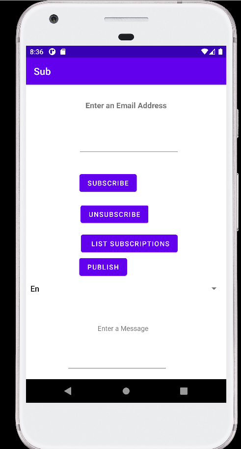
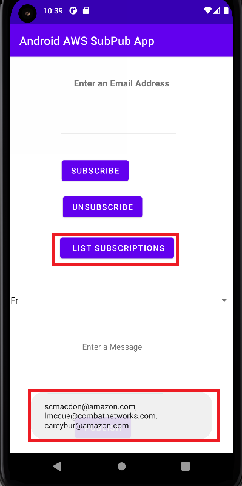
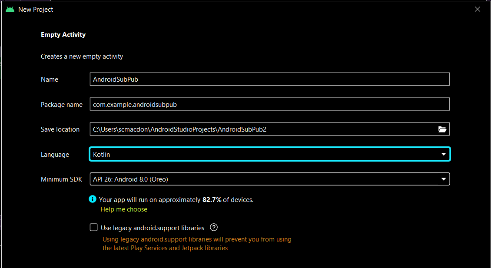
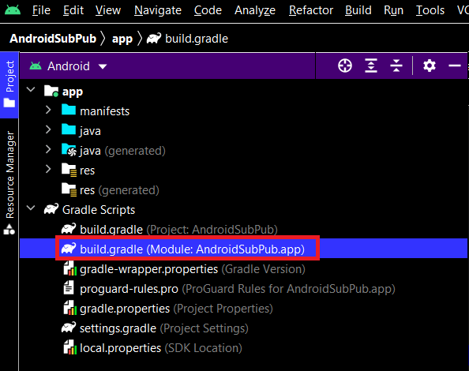
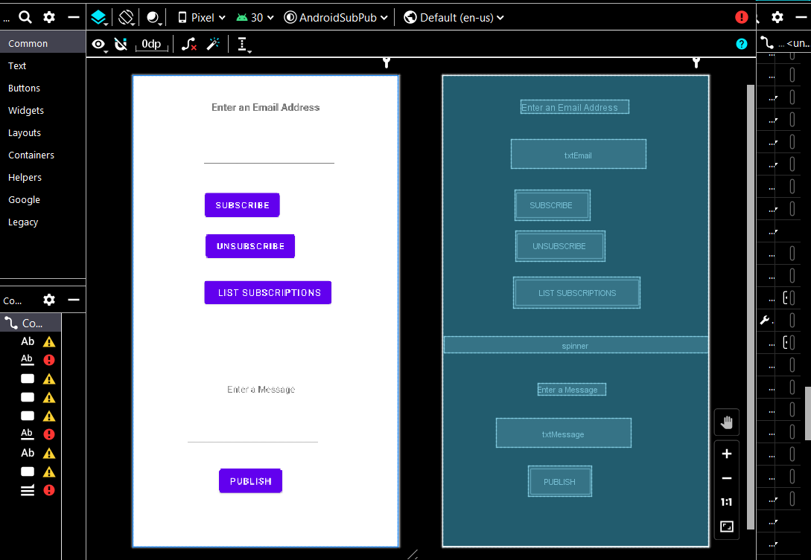

# Creating a publish-subscription Android application that translates messages using the AWS SDK for Kotlin

## Overview

| Heading      | Description |
| ----------- | ----------- |
| Description | Discusses how to develop a native Android application that has publish-subsciption functionality as well as the ability to translate messages by using the AWS SDK for Kotlin.     |
| Audience   |  Developer (beginner / intermediate)        |
| Updated   | 1/18/2022        |
| Required Skills   | Kotlin, Gradle  |

## Purpose

You can create a native Android application that has subscription and publish functionality by using the Amazon Simple Notification Service (Amazon SNS) and the AWS SDK for Kotlin. The application created in this AWS tutorial is an Android application that lets a user subscribe to an Amazon SNS topic by entering a valid email address. A user can enter many emails and all of them are subscribed to the given SNS topic (once the email recipients confirm the subscription). The user can publish a message that results in all subscribed emails receiving the message. If desired, the user can select another langange and the message is translated by using the Amazon Translate service.

**Note**: Amazon SNS is a managed service that provides message delivery from publishers to subscribers (also known as producers and consumers). For more information, see [What is Amazon SNS?](https://docs.aws.amazon.com/sns/latest/dg/welcome.html)


#### Topics

+ Prerequisites
+ Understand the Publish-Subscribe application
+ Create an Android project 
+ Add the dependencies to your Andorid project
+ Create the layout XML file for your Android project
+ Create the Kotlin classes for your Android project
+ Run the Android application


## Prerequisites

To complete the tutorial, you need the following:

+ An AWS account
+ An IDE that lets you build Android projects (this example uses Android Studio)
+ Java 1.8 SDK
+ Gradle 6.8 or higher
+ Min API version is 24
+ Requires core library desugaring in the Gradle build file
+ Source/target compat of 1.8


### ⚠️ Important

+ The AWS services included in this document are included in the [AWS Free Tier](https://aws.amazon.com/free/?all-free-tier.sort-by=item.additionalFields.SortRank&all-free-tier.sort-order=asc).
+  This code has not been tested in all AWS Regions. Some AWS services are available only in specific regions. For more information, see [AWS Regional Services](https://aws.amazon.com/about-aws/global-infrastructure/regional-product-services). 
+ Running this code might result in charges to your AWS account. 
+ Be sure to terminate all of the resources you create while going through this tutorial to ensure that you’re not charged.

### Creating the resources

Create an Amazon SNS queue that is used. For information, see [Creating an Amazon SNS topic](https://docs.aws.amazon.com/sns/latest/dg/sns-create-topic.html).

In addition, make sure that you setup your Kotlin developer environment before following along with this tutorial. For more information, see [Setting up the AWS SDK for Kotlin](https://docs.aws.amazon.com/sdk-for-kotlin/latest/developer-guide/setup.html). 

## Understand the Publish-Subscribe application

To subscribe to an Amazon SNS topic, the user enters a valid email address into the Android application and chooses the **Subscribe** button. 



The specified email address recieves an email message that lets the recipient confirm the subscription. 


Once the email recipient accepts the confirmation, that email is subscribed to the specific SNS topic and recieves published messages. To publish a message, a user enters the message into the web application and then chooses the **Publish** button. 


This application lets a user specify the language of the message that is sent. For example, the user can select **Fr** from the dropdown field and then the message appears in that language to all subscribed users. 


**Note**: The Amazon Translate Service is used to translate the body of the message. The code is shown later in this document. 

This example application lets you view all of the subscribed email recipients by choosing the **List Subscriptions** button, as shown in the following illustration.




## Create an Android project

The first step is to create an Android project.



1. In Android Studio, choose **File**, **New**, **Project**.
2. In the **New Project** dialog box, choose **Empty Activity**.
3. Choose **Next**.
5. In the **Name** field, enter **AndroidSubPub**.
6. In the **Package name** field, enter **com.example.androidsubpub**. 
7. From the **Language** field, choose **Kotlin**. 
8. In the **Minimum API** field, specify **API 26 - Android 8**.
9. Choose **Finish**.

## Add the dependencies to your Android project

At this point, you have a new project named **AndroidSubPub** with a default Kotlin class named **MainActivity**. Notice that there is Gradle build file here:



Add the following dependencies to the Gradle build file.

```yaml
   plugins {
    id 'com.android.application'
    id 'kotlin-android'
   }

   android {
    compileSdk 30

    defaultConfig {
        applicationId "com.example.awsapp"
        minSdk 26
        targetSdk 30
        versionCode 1
        versionName "1.0"

        testInstrumentationRunner "androidx.test.runner.AndroidJUnitRunner"
    }

    buildTypes {

        create("customDebugType") {
            debuggable = true
        }
        release {
            minifyEnabled false
            proguardFiles getDefaultProguardFile('proguard-android-optimize.txt'), 'proguard-rules.pro'
        }
       }
      compileOptions {
        sourceCompatibility JavaVersion.VERSION_1_8
        targetCompatibility JavaVersion.VERSION_1_8
      }
      kotlinOptions {
        jvmTarget = '1.8'
      } 
   }

   dependencies {

     implementation 'androidx.core:core-ktx:1.6.0'
     implementation("aws.sdk.kotlin:translate:0.9.4-beta")
     implementation("aws.sdk.kotlin:sns:0.9.4-beta")  {
        exclude group: "xmlpull", module: "xmlpull"
     }
     coreLibraryDesugaring 'com.android.tools:desugar_jdk_libs:1.1.5'
     implementation 'androidx.appcompat:appcompat:1.3.1'
     implementation 'com.google.android.material:material:1.4.0'
     implementation 'androidx.constraintlayout:constraintlayout:2.1.0'
     testImplementation 'junit:junit:4.+'
     androidTestImplementation 'androidx.test.ext:junit:1.1.3'
     androidTestImplementation 'androidx.test.espresso:espresso-core:3.4.0'
     }

```

## Create the layout XML file for your Android project

The user interface for your Android project is defined in an XML file named **activity_main.xml**, as shown in this illustration. 



You can modify the **activity_main.xml** file with the following XML code. 


```yaml
     <?xml version="1.0" encoding="utf-8"?>
<androidx.constraintlayout.widget.ConstraintLayout xmlns:android="http://schemas.android.com/apk/res/android"
    xmlns:app="http://schemas.android.com/apk/res-auto"
    xmlns:tools="http://schemas.android.com/tools"
    android:layout_width="match_parent"
    android:layout_height="match_parent"
    tools:context=".MainActivity">

    <TextView
        android:layout_width="wrap_content"
        android:layout_height="wrap_content"
        android:text="Enter an Email Address"
        android:textSize="16sp"
        android:textStyle="bold"
        app:layout_constraintBottom_toBottomOf="parent"
        app:layout_constraintLeft_toLeftOf="parent"
        app:layout_constraintRight_toRightOf="parent"
        app:layout_constraintTop_toTopOf="parent"
        app:layout_constraintVertical_bias="0.053" />

    <EditText
        android:id="@+id/txtEmail"
        android:layout_width="wrap_content"
        android:layout_height="wrap_content"
        android:layout_marginTop="100dp"
        android:layout_marginEnd="96dp"
        android:ems="10"
        android:inputType="textEmailAddress"
        app:layout_constraintEnd_toEndOf="parent"
        app:layout_constraintTop_toTopOf="parent" />

    <Button
        android:id="@+id/btnSub"
        android:layout_width="wrap_content"
        android:layout_height="wrap_content"
        android:layout_marginTop="32dp"
        android:layout_marginEnd="184dp"
        android:onClick="subUser"
        android:text="Subscribe"
        app:layout_constraintEnd_toEndOf="parent"
        app:layout_constraintTop_toBottomOf="@+id/txtEmail" />

    <Button
        android:id="@+id/btnUnSub"
        android:layout_width="wrap_content"
        android:layout_height="wrap_content"
        android:layout_marginTop="16dp"
        android:layout_marginEnd="160dp"
        android:onClick="unSubUser"
        android:text="UnSubscribe"
        app:layout_constraintEnd_toEndOf="parent"
        app:layout_constraintTop_toBottomOf="@+id/btnSub" />

    <Button
        android:id="@+id/btnList"
        android:layout_width="wrap_content"
        android:layout_height="wrap_content"
        android:layout_marginTop="24dp"
        android:layout_marginEnd="104dp"
        android:onClick="getSubs"
        android:text=" List Subscriptions"
        app:layout_constraintEnd_toEndOf="parent"
        app:layout_constraintTop_toBottomOf="@+id/btnUnSub" />

    <EditText
        android:id="@+id/txtMessage"
        android:layout_width="wrap_content"
        android:layout_height="wrap_content"
        android:layout_marginTop="36dp"
        android:layout_marginEnd="120dp"
        android:ems="10"
        android:gravity="start|top"
        android:inputType="textMultiLine"
        app:layout_constraintEnd_toEndOf="parent"
        app:layout_constraintTop_toBottomOf="@+id/textView" />

    <TextView
        android:id="@+id/textView"
        android:layout_width="wrap_content"
        android:layout_height="wrap_content"
        android:layout_marginTop="48dp"
        android:layout_marginEnd="160dp"
        android:text="Enter a Message"
        app:layout_constraintEnd_toEndOf="parent"
        app:layout_constraintTop_toBottomOf="@+id/spinner" />

    <Button
        android:id="@+id/btnPublish"
        android:layout_width="wrap_content"
        android:layout_height="wrap_content"
        android:layout_marginTop="28dp"
        android:layout_marginEnd="180dp"
        android:onClick="pubTopic"
        android:text="Publish"
        app:layout_constraintEnd_toEndOf="parent"
        app:layout_constraintTop_toBottomOf="@+id/txtMessage" />

    <Spinner
        android:id="@+id/spinner"
        android:layout_width="409dp"
        android:layout_height="wrap_content"
        android:layout_marginTop="44dp"
        app:layout_constraintEnd_toEndOf="parent"
        app:layout_constraintStart_toStartOf="parent"
        app:layout_constraintTop_toBottomOf="@+id/btnList" />

</androidx.constraintlayout.widget.ConstraintLayout>
```

 ## Create the Kotlin classes for your Android project
 
In the **com.example.androidsubpub** package, notice there is a class named **MainActivity**. This is the class that contains the logic to perform the the AWS Service operations. To handle the required AWS Credentials, notice the use of a **StaticCredentialsProvider** object. 

Notice the following methods that use the AWS SDK for Kotlin to perform various AWS Service operations:

+ **onItemSelected** - Retrieves the value selected from the Spinner control. 
+ **pubTopic** -  Publishes a message. 
+ **getSubs** - Gets all subscriptions. 
+ **unSubUser** - Removes a subscription based on an email address.
+ **subUser** - Creates a new subscription.
 
The following Kotlin code represents the **MainActivity** Kotlin class. 

```kotlin
     package com.example.androidsubpub

     import androidx.appcompat.app.AppCompatActivity
     import android.os.Bundle
     import android.view.View
     import android.widget.*
     import kotlinx.coroutines.runBlocking
     import aws.sdk.kotlin.runtime.auth.credentials.StaticCredentialsProvider
     import aws.sdk.kotlin.services.sns.SnsClient
     import aws.sdk.kotlin.services.sns.model.*
     import java.util.regex.Pattern
     import kotlin.system.exitProcess
     import aws.sdk.kotlin.services.sns.model.SnsException
     import aws.sdk.kotlin.services.sns.model.ListSubscriptionsByTopicRequest
     import aws.sdk.kotlin.services.translate.TranslateClient
     import aws.sdk.kotlin.services.translate.model.TranslateTextRequest

    class MainActivity : AppCompatActivity(), AdapterView.OnItemSelectedListener {

     var topicArnVal = "<Enter topic ARN>"
     val items = arrayOf("En", "Fr", "Sp")
     var chosenLan: String =""

     override fun onCreate(savedInstanceState: Bundle?) {
        super.onCreate(savedInstanceState)
        setContentView(R.layout.activity_main)
        val dropdown =  findViewById<Spinner>(R.id.spinner)
        dropdown.onItemSelectedListener = this
        val adapter = ArrayAdapter(this, android.R.layout.simple_spinner_dropdown_item, items)
        dropdown.adapter = adapter
     }

     override fun onItemSelected(parent: AdapterView<*>?,
                                view: View, position: Int,
                                id: Long) {

        chosenLan = parent?.getItemAtPosition(position).toString()
        val toast = Toast.makeText(applicationContext, chosenLan, Toast.LENGTH_SHORT)
        toast.setMargin(50f, 50f)
        toast.show()
     }

     override fun onNothingSelected(parent: AdapterView<*>?) {
        TODO("Not yet implemented")
     }

    // Publish a message.
    fun pubTopic(view: View) = runBlocking {

        val snsClient = getClient()
        val translateClient = getTranslateClient()
        val bodyMessage: EditText = findViewById(R.id.txtMessage)
        val body = bodyMessage.text.toString()
        var translateBody: String

        // Need to translate the message if user selected another language.
        if (chosenLan == "Fr" ) {

            val textRequest = TranslateTextRequest {
                sourceLanguageCode = "en"
                targetLanguageCode = "fr"
                text = body
            }

            val textResponse = translateClient.translateText(textRequest)
            translateBody = textResponse.translatedText.toString()

        } else if (chosenLan == "Sp" ) {

            val textRequest = TranslateTextRequest {
                    sourceLanguageCode = "en"
                    targetLanguageCode = "es"
                    text = body
                }

            val textResponse = translateClient.translateText(textRequest)
            translateBody = textResponse.translatedText.toString()

        } else
            translateBody = body

        try {

            val request = PublishRequest {
                message = translateBody
                topicArn = topicArnVal
            }

            val result = snsClient.publish(request)
            showToast("{$result.messageId.toString()} published!")

        } catch (e: SnsException) {
            println(e.message)
            snsClient.close()
        }
      }

     // Get all subscriptions.
     fun getSubs(view: View) = runBlocking {

        val subList = mutableListOf<String>()
        val snsClient: SnsClient = getClient()
        try {

            val request = ListSubscriptionsByTopicRequest {
                topicArn = topicArnVal
            }
            val response = snsClient.listSubscriptionsByTopic(request)
            response.subscriptions?.forEach { sub ->
                subList.add(sub.endpoint.toString())
            }

            val listString = java.lang.String.join(", ", subList)
            showToast(listString)

       } catch (e: SnsException) {
            println(e.message)
            snsClient.close()
        }
       }

      // Remove a subscription based on an email.
      fun unSubUser(view: View) = runBlocking {

        val snsClient = getClient()
        val emailVal: EditText = findViewById(R.id.txtEmail)
        val emailStr = emailVal.text.toString()
        val isValidEmail = checkEmail(emailStr)

        // Make sure that the email is valid.
        if (!isValidEmail) {
            showToast("Email not valid")
        } else {
             try {
                 var subArn = ""
                 val listRequest = ListSubscriptionsByTopicRequest {
                     topicArn = topicArnVal
                 }
                 val response = snsClient.listSubscriptionsByTopic(listRequest)
                 response.subscriptions?.forEach { sub ->

                     if (sub.endpoint?.compareTo(emailStr) == 0) {
                         subArn = sub.subscriptionArn.toString()
                     }
                 }

                    val request = UnsubscribeRequest {
                        subscriptionArn = subArn
                    }

                    snsClient.unsubscribe(request)
                    showToast("$emailStr was unsubscribed")

                } catch (e: SnsException) {
                    println(e.message)
                    snsClient.close()
                    exitProcess(0)
                }
          }
       }

      // Create a new subscription.
     fun subUser(view: View) = runBlocking{

        val snsClient = getClient()

        val emailVal: EditText =  findViewById(R.id.txtEmail)
        val emailStr = emailVal.text.toString()
        val isValidEmail = checkEmail(emailStr)

        // Make sure that the email is valid.
        if (!isValidEmail) {
            showToast("Email not valid")
        }
        else {
            try {
                val request = SubscribeRequest {
                    protocol = "email"
                    endpoint = emailStr
                    returnSubscriptionArn = true
                    topicArn = topicArnVal
                }

               val result = snsClient.subscribe(request)
               showToast(result.subscriptionArn.toString())

            } catch (e: SnsException) {
                println(e.message)
                snsClient.close()
                exitProcess(0)
            }
        }
      }

      // Returns the Sub Amazon Resource Name (ARN) based on the given endpoint used for unSub.
      suspend fun getTopicArnValue(snsClient: SnsClient, endpoint: String): String? {

                try {
                    var subArn: String

                    val request = ListSubscriptionsByTopicRequest {
                        topicArn = topicArnVal
                    }

                    val response = snsClient.listSubscriptionsByTopic(request)
                    response.subscriptions?.forEach { sub ->

                        if (sub.endpoint?.compareTo(endpoint) ==0 ) {
                            subArn = sub.subscriptionArn.toString()
                            return subArn
                        }
                    }

                    return ""
                } catch (e: SnsException) {
                    println(e.message)
                    snsClient.close()
                    exitProcess(0)
                }
            }


      fun getTranslateClient() : TranslateClient{

        val staticCredentials = StaticCredentialsProvider {
            accessKeyId = "<Enter key>"
            secretAccessKey = "<Enter key>"
        }

        val translateClient = TranslateClient{
            region = "us-west-2"
            credentialsProvider = staticCredentials
        }

        return translateClient
     }

    fun getClient() : SnsClient{

        val staticCredentials = StaticCredentialsProvider {
            accessKeyId = "<Enter key>"
            secretAccessKey = "<Enter key>"
        }

        val snsClient = SnsClient{
            region = "us-west-2"
            credentialsProvider = staticCredentials
        }

        return snsClient
    }

    fun showToast(value:String){
        val toast = Toast.makeText(applicationContext, value, Toast.LENGTH_SHORT)
        toast.setMargin(50f, 50f)
        toast.show()
    }

    fun checkEmail(email: String?): Boolean {
        return EMAIL_ADDRESS_PATTERN.matcher(email).matches()
    }

    val EMAIL_ADDRESS_PATTERN: Pattern = Pattern.compile(
        "[a-zA-Z0-9\\+\\.\\_\\%\\-\\+]{1,256}" +
                "\\@" +
                "[a-zA-Z0-9][a-zA-Z0-9\\-]{0,64}" +
                "(" +
                "\\." +
                "[a-zA-Z0-9][a-zA-Z0-9\\-]{0,25}" +
                ")+"
      )
    }

```

**Note**: Be sure that you enter your topic ARN and your credential key values; otherwise, your code does not work. 

## Run the Android application

To run the application from the IDE, you must ensure that have you have installed an Android emulator which simulates an Android application. For more information, see [Run apps on the Android Emulator](https://developer.android.com/studio/run/emulator).  

Once you install the emulator, you can run the application and then the application appears in the emulator. 

### Next steps
Congratulations! You have created a native Android application that interacts with AWS services by using the AWS SDK for Kotlin. As stated at the beginning of this tutorial, be sure to terminate all of the resources that you created while going through this tutorial to ensure that you’re no longer charged for them.
